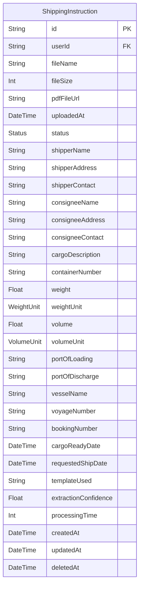
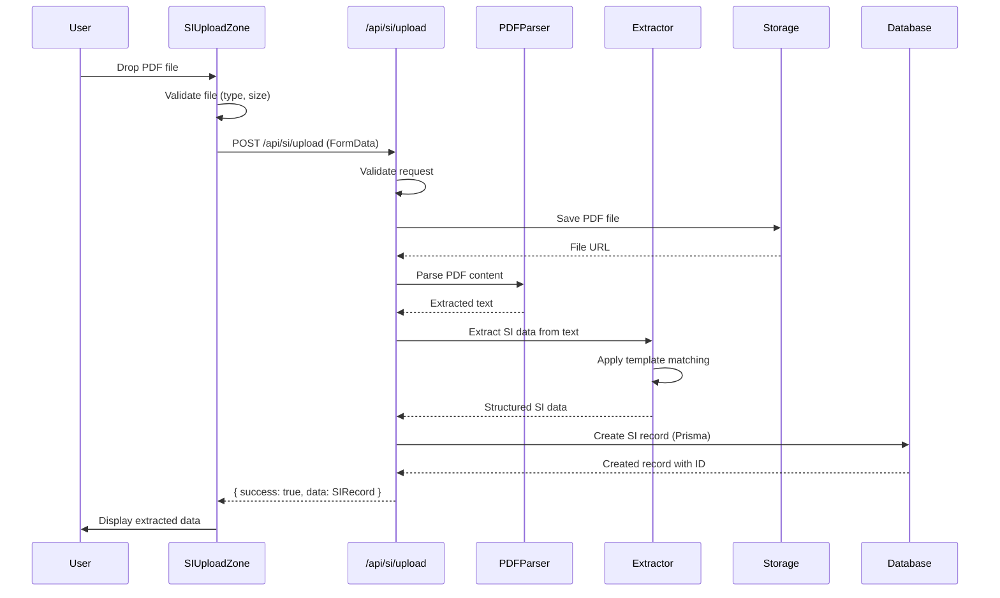

# Implementation Plan: Upload and Extract SI Data from PDF (Phase 2)

**User Story:** [01-upload-and-extract-si-data-from-pdf.md](../stories/01-upload-and-extract-si-data-from-pdf.md)

**Created:** December 16, 2025

**Status:** Phase 1 Complete (UI with Mock Data) | Phase 2 Implementation Plan

## Feature Overview

This plan outlines Phase 2 implementation for the SI PDF Upload feature. Phase 1 (UI with mock data) has been completed successfully. Phase 2 focuses on integrating real PDF parsing, implementing API endpoints, adding database persistence, and connecting the UI to real backend services.

The primary user role is an **external customer** who needs to upload Shipping Instruction PDFs and have data automatically extracted to streamline the shipping instruction processing workflow.

## Component Analysis & Reuse Strategy

### Existing Components (Phase 1 - Completed)

**UI Components (Reusable As-Is):**
- `src/components/ui/Button.tsx` - Reuse for actions
- `src/components/ui/Card.tsx` - Reuse for layout containers
- `src/components/ui/Input.tsx` - Reuse for form fields
- `src/components/ui/Modal.tsx` - Reuse for dialogs
- `src/components/ui/ProgressBar.tsx` - Reuse for progress indication
- `src/components/ui/Toast.tsx` - Reuse for notifications

**Feature Components (Require Modification):**
- `src/components/features/si-upload/SIUploadZone.tsx` - **MODIFY** to call real API endpoint instead of mock simulation
- `src/components/features/si-upload/SIDataForm.tsx` - **MODIFY** to integrate with database-backed data
- `src/components/features/si-upload/UploadProgress.tsx` - Reuse as-is

**Justification:**
All Phase 1 components follow Next.js 15 patterns and the gaming-themed design system. The upload zone and form components need modification only to replace mock data sources with real API calls. No component requires a complete rewrite.

### New Components Required

**None** - Phase 2 focuses on backend infrastructure (API routes, database, PDF parsing). All UI components from Phase 1 remain functional and will be connected to real APIs.

## 3. Affected Files

**Backend & API:**
- `[CREATE] prisma/schema.prisma` - Database schema for SI data
- `[CREATE] src/app/api/si/upload/route.ts` - Handle PDF upload and extraction
- `[CREATE] src/app/api/si/[id]/route.ts` - CRUD operations for SI records
- `[CREATE] src/lib/pdf/parser.ts` - PDF parsing logic using pdf-parse
- `[CREATE] src/lib/pdf/extractor.ts` - Template-based data extraction
- `[CREATE] src/lib/storage/file-handler.ts` - File storage management
- `[CREATE] src/lib/db/si-repository.ts` - Database operations for SI data
- `[CREATE] src/app/api/si/upload/route.test.ts` - API route tests

**Frontend (Modifications):**
- `[MODIFY] src/components/features/si-upload/SIUploadZone.tsx` - Replace mock with API call
- `[MODIFY] app/si-upload/page.tsx` - Add error handling for real API
- `[MODIFY] src/types/si-data.ts` - Add database-related types

**Configuration:**
- `[MODIFY] package.json` - Add pdf-parse and Prisma dependencies
- `[CREATE] .env.local.example` - Environment variable template
- `[CREATE] docs/erd.md` - Database entity relationship diagram

**Testing:**
- `[CREATE] src/lib/pdf/parser.test.ts` - PDF parsing tests
- `[CREATE] src/lib/pdf/extractor.test.ts` - Extraction logic tests
- `[CREATE] src/lib/db/si-repository.test.ts` - Repository tests

## 4. Component Breakdown

### Modified Components

#### SIUploadZone.tsx
**Location:** `src/components/features/si-upload/SIUploadZone.tsx`  
**Type:** Client Component (already implemented)  
**Modifications:**
- Replace `simulateExtraction` with real API call to `/api/si/upload`
- Use `FormData` to send PDF file to server
- Handle real-time progress updates via streaming response or polling
- Add proper error handling for network failures
- Maintain existing UI/UX behavior

**Key Changes:**
```typescript
// Before (Phase 1 - Mock):
const simulateExtraction = async (file: File) => { /* mock logic */ }

// After (Phase 2 - Real API):
const uploadAndExtract = async (file: File) => {
  const formData = new FormData();
  formData.append('file', file);
  
  const response = await fetch('/api/si/upload', {
    method: 'POST',
    body: formData,
  });
  
  const result = await response.json();
  // Handle real extraction result
}
```

#### SIDataForm.tsx
**Location:** `src/components/features/si-upload/SIDataForm.tsx`  
**Type:** Client Component (already implemented)  
**Modifications:**
- Accept `ExtractedSIData` from database (with `id` field)
- Enable navigation to review/edit page using database ID
- No significant structural changes needed

## 5. Design Specifications

**Note:** Phase 1 UI is complete and follows the gaming-themed dark design with cyan accents. No design changes are required for Phase 2.

**Existing Design Tokens (Phase 1):**
- Background: `#000000` (pure black)
- Primary accent: `#22d3ee` (cyan) with glow effect
- Text primary: `#ffffff`
- Text secondary: `#a1a1aa`
- Card background: `#18181b`
- Border color: `#27272a`
- Error color: `#ef4444`
- Success color: `#22c55e`

**Implementation Consistency:**
All Phase 2 backend functionality maintains the existing UI without visual changes.

## 6. Data Flow & State Management

### TypeScript Types/Interfaces

**Location:** `src/types/si-data.ts`

**Add Database-Related Types:**
```typescript
// Add to existing types:
export interface SIRecord extends ExtractedSIData {
  userId?: string; // For multi-tenant support
  createdAt: Date;
  updatedAt: Date;
  pdfFileUrl: string; // Storage location
  extractionMetadata?: {
    templateUsed: string;
    confidence: number;
    processingTime: number;
  };
}

export interface UploadRequest {
  file: File;
}

export interface UploadApiResponse {
  success: boolean;
  data?: SIRecord;
  error?: {
    code: string;
    message: string;
    details?: any;
  };
}
```

### Data Fetching Strategy

**Server-Side (API Routes):**
1. **POST `/api/si/upload`** - Receives PDF file, parses, extracts, saves to DB
2. **GET `/api/si/[id]`** - Retrieves SI record by ID from database
3. **PUT `/api/si/[id]`** - Updates SI record (for future edit functionality)
4. **DELETE `/api/si/[id]`** - Soft delete SI record

**Client-Side Fetching:**
- `SIUploadZone` component makes POST request to `/api/si/upload`
- Form data used for file upload (multipart/form-data)
- Response includes extracted data and database ID
- Error handling for file size, type validation, parsing errors

### State Management

**Local Component State:**
- Upload progress (existing in `SIUploadZone`)
- Extracted data (existing in `app/si-upload/page.tsx`)
- Error messages (existing)

**No Zustand Required:** Phase 2 maintains stateless architecture. Data flows from API → component props without global state.

### Database Schema

**Location:** `prisma/schema.prisma`

**Models:**

```prisma
model ShippingInstruction {
  id                String   @id @default(cuid())
  userId            String?  // Future: link to user accounts
  
  // File metadata
  fileName          String
  fileSize          Int
  pdfFileUrl        String
  uploadedAt        DateTime @default(now())
  
  // Status tracking
  status            Status   @default(EXTRACTED)
  
  // Shipper Information
  shipperName       String
  shipperAddress    String
  shipperContact    String
  
  // Consignee Information
  consigneeName     String
  consigneeAddress  String
  consigneeContact  String
  
  // Cargo Details
  cargoDescription  String
  containerNumber   String
  weight            Float
  weightUnit        WeightUnit
  volume            Float
  volumeUnit        VolumeUnit
  
  // Shipping Details
  portOfLoading     String
  portOfDischarge   String
  vesselName        String?
  voyageNumber      String?
  bookingNumber     String
  
  // Dates
  cargoReadyDate    DateTime
  requestedShipDate DateTime
  
  // Extraction metadata
  templateUsed      String?
  extractionConfidence Float?
  processingTime    Int?      // milliseconds
  
  // Timestamps
  createdAt         DateTime @default(now())
  updatedAt         DateTime @updatedAt
  deletedAt         DateTime?
  
  @@index([userId])
  @@index([status])
  @@index([uploadedAt])
}

enum Status {
  PENDING
  EXTRACTED
  VALIDATED
  SUBMITTED
}

enum WeightUnit {
  KG
  LBS
}

enum VolumeUnit {
  CBM
  CFT
}
```

**ER Diagram:**



## 7. API Endpoints & Contracts

### POST /api/si/upload

**Route Path:** `src/app/api/si/upload/route.ts`

**HTTP Method:** POST

**Request:**
- **Content-Type:** multipart/form-data
- **Body:**
  - `file`: PDF file (max 10MB)

**Response (Success):**
```typescript
{
  success: true,
  data: {
    id: "clxxx123...",
    fileName: "SI-12345.pdf",
    uploadedAt: "2025-12-16T10:30:00.000Z",
    status: "extracted",
    shipperName: "Acme Corporation",
    // ... all extracted SI fields
    extractionMetadata: {
      templateUsed: "standard-v1",
      confidence: 0.95,
      processingTime: 1250
    }
  }
}
```

**Response (Error):**
```typescript
{
  success: false,
  error: {
    code: "FILE_TOO_LARGE" | "INVALID_FILE_TYPE" | "EXTRACTION_FAILED" | "PARSE_ERROR",
    message: "Human-readable error message",
    details?: any
  }
}
```

**Status Codes:**
- 200: Success
- 400: Invalid request (file size, type validation)
- 500: Server error (parsing, extraction, database)

**Core Server-Side Logic:**
1. Validate file type (PDF only)
2. Validate file size (max 10MB)
3. Generate unique file identifier
4. Save PDF to storage (local filesystem initially)
5. Parse PDF using `pdf-parse` library
6. Extract SI data using template matching
7. Create database record via Prisma
8. Return extracted data with database ID

---

### GET /api/si/[id]

**Route Path:** `src/app/api/si/[id]/route.ts`

**HTTP Method:** GET

**Response (Success):**
```typescript
{
  success: true,
  data: SIRecord
}
```

**Response (Error):**
```typescript
{
  success: false,
  error: {
    code: "NOT_FOUND" | "DATABASE_ERROR",
    message: "SI record not found"
  }
}
```

**Status Codes:**
- 200: Success
- 404: SI record not found
- 500: Database error

**Core Server-Side Logic:**
1. Extract `id` from route params
2. Query database using Prisma
3. Return SI record if found
4. Return 404 if not found

---

### PUT /api/si/[id]

**Route Path:** `src/app/api/si/[id]/route.ts`

**HTTP Method:** PUT

**Request:**
```typescript
{
  data: Partial<ExtractedSIData>
}
```

**Response (Success):**
```typescript
{
  success: true,
  data: SIRecord
}
```

**Status Codes:**
- 200: Update successful
- 404: SI record not found
- 400: Invalid data
- 500: Database error

**Core Server-Side Logic:**
1. Extract `id` from route params
2. Validate update payload
3. Update database record
4. Return updated record

---

### DELETE /api/si/[id]

**Route Path:** `src/app/api/si/[id]/route.ts`

**HTTP Method:** DELETE

**Response (Success):**
```typescript
{
  success: true,
  message: "SI record deleted"
}
```

**Status Codes:**
- 200: Delete successful
- 404: SI record not found
- 500: Database error

**Core Server-Side Logic:**
1. Extract `id` from route params
2. Soft delete (set `deletedAt` timestamp)
3. Return success response

## 8. Integration Diagram



## 9. Styling

**No Changes Required** - Phase 1 UI styling is complete and follows design specifications.

**Gaming-Themed Design (Maintained):**
- Pure black background (`#000000`)
- Cyan accent color (`#22d3ee`) with glow effects
- Dark card backgrounds (`#18181b`)
- Consistent spacing and typography from Phase 1

**Implementation:**
All styles use direct hex values in Tailwind classes as established in Phase 1.

## 10. Testing Strategy

### Unit Tests

**PDF Parser Tests** (`src/lib/pdf/parser.test.ts`):
- Parse valid PDF files
- Handle corrupted PDF files
- Handle non-PDF files
- Handle empty files
- Handle large files
- Extract text accurately

**Data Extractor Tests** (`src/lib/pdf/extractor.test.ts`):
- Extract shipper information correctly
- Extract consignee information correctly
- Extract cargo details correctly
- Extract shipping details correctly
- Extract dates correctly
- Handle missing fields gracefully
- Handle malformed data
- Template matching accuracy

**Database Repository Tests** (`src/lib/db/si-repository.test.ts`):
- Create SI record successfully
- Read SI record by ID
- Update SI record
- Soft delete SI record
- Query SI records with filters
- Handle database errors

**API Route Tests** (`src/app/api/si/upload/route.test.ts`):
- Upload valid PDF successfully
- Reject invalid file types
- Reject oversized files
- Handle parsing errors
- Handle extraction errors
- Handle database errors
- Return correct response format

**Test Coverage Goal:** 80%+ for backend logic (PDF parsing, extraction, database operations)

## 11. Accessibility (A11y) Considerations

**Phase 1 A11y (Maintained):**
- All form inputs have proper labels
- Error messages associated with fields via `aria-describedby`
- Progress indicators have `role="progressbar"` and `aria-valuenow`
- Keyboard navigation fully functional
- Focus management during upload process

**Phase 2 A11y:**
- API error messages must be clear and actionable
- Loading states communicated to screen readers
- File upload errors announced via live regions

## 12. Security Considerations

**File Upload Security:**
- Validate file type (PDF only) on both client and server
- Enforce file size limits (10MB max)
- Sanitize file names before storage
- Generate unique file identifiers (prevent path traversal)
- Store files outside public directory

**Data Protection:**
- No authentication in initial implementation (single-user)
- Future: Add user authentication and authorization
- Validate all data before database insertion
- Use Prisma parameterized queries (SQL injection protection)
- Implement rate limiting on upload endpoint (future)

**Error Handling:**
- Do not expose internal error details to client
- Log detailed errors server-side
- Return generic error messages to client

**Environment Variables:**
- Database connection string
- File storage path
- Max file size configuration

## 13. Implementation Steps

### Phase 2: API Integration with Real Data

**1. Setup & Dependencies:**

- [ ] Install pdf-parse: `npm install pdf-parse`
- [ ] Install Prisma: `npm install @prisma/client && npm install -D prisma`
- [ ] Initialize Prisma: `npx prisma init`
- [ ] Configure database connection (SQLite for development)
- [ ] Create `.env.local` with DATABASE_URL
- [ ] Create `.env.local.example` template
- [ ] Add `.env.local` to `.gitignore`

**2. Database Schema:**

- [ ] Create `prisma/schema.prisma` with ShippingInstruction model
- [ ] Run initial migration: `npx prisma migrate dev --name init`
- [ ] Generate Prisma Client: `npx prisma generate`
- [ ] Create `docs/erd.md` with ER diagram from section 6

**3. File Storage Setup:**

- [ ] Create `src/lib/storage/file-handler.ts`
- [ ] Implement `saveFile(file: File): Promise<string>` - returns file URL
- [ ] Implement `getFile(fileUrl: string): Promise<Buffer>`
- [ ] Implement `deleteFile(fileUrl: string): Promise<void>`
- [ ] Create storage directory: `data/uploads/` (git-ignored)
- [ ] Add storage directory to `.gitignore`

**4. PDF Parsing Logic:**

- [ ] Create `src/lib/pdf/parser.ts`
- [ ] Implement `parsePDF(buffer: Buffer): Promise<string>` using pdf-parse
- [ ] Handle parsing errors gracefully
- [ ] Return extracted text content
- [ ] Add logging for parsing issues

**5. Data Extraction Logic:**

- [ ] Create `src/lib/pdf/extractor.ts`
- [ ] Implement `extractSIData(text: string): Promise<ExtractedSIData>`
- [ ] Use regex patterns for common SI template format
- [ ] Extract shipper/consignee information
- [ ] Extract cargo details (description, weight, volume)
- [ ] Extract shipping details (ports, vessel, booking number)
- [ ] Extract dates (cargo ready date, requested ship date)
- [ ] Set default values for optional fields
- [ ] Calculate extraction confidence score

**6. Database Repository:**

- [ ] Create `src/lib/db/si-repository.ts`
- [ ] Implement `createSI(data: ExtractedSIData, metadata: any): Promise<SIRecord>`
- [ ] Implement `getSIById(id: string): Promise<SIRecord | null>`
- [ ] Implement `updateSI(id: string, data: Partial<ExtractedSIData>): Promise<SIRecord>`
- [ ] Implement `deleteSI(id: string): Promise<void>` (soft delete)
- [ ] Implement `listSIs(filters?: any): Promise<SIRecord[]>` (future)
- [ ] Add error handling for database operations

**7. Upload API Endpoint:**

- [ ] Create `src/app/api/si/upload/route.ts`
- [ ] Implement POST handler:
  - [ ] Parse multipart/form-data (use Next.js built-in)
  - [ ] Validate file type (application/pdf)
  - [ ] Validate file size (max 10MB)
  - [ ] Save file using file-handler
  - [ ] Parse PDF using parser
  - [ ] Extract SI data using extractor
  - [ ] Create database record using repository
  - [ ] Return success response with data
  - [ ] Handle errors and return appropriate status codes
- [ ] Add request logging

**8. CRUD API Endpoints:**

- [ ] Create `src/app/api/si/[id]/route.ts`
- [ ] Implement GET handler (retrieve by ID)
- [ ] Implement PUT handler (update)
- [ ] Implement DELETE handler (soft delete)
- [ ] Add proper error handling
- [ ] Return appropriate status codes

**9. Update Type Definitions:**

- [ ] Modify `src/types/si-data.ts`
- [ ] Add `SIRecord` interface with database fields
- [ ] Add `UploadApiResponse` interface
- [ ] Add extraction metadata types
- [ ] Export all new types

**10. Frontend Integration:**

- [ ] Modify `src/components/features/si-upload/SIUploadZone.tsx`
- [ ] Replace `simulateExtraction` with real API call:
  - [ ] Create FormData with PDF file
  - [ ] POST to `/api/si/upload`
  - [ ] Handle response data
  - [ ] Update progress based on API response
  - [ ] Handle API errors (network, validation, server)
- [ ] Update error messages for real scenarios
- [ ] Maintain existing progress UI

**11. Page-Level Integration:**

- [ ] Modify `app/si-upload/page.tsx`
- [ ] Update `handleUploadComplete` to accept database-backed data
- [ ] Add navigation to review page using SI record ID
- [ ] Enhance error handling for API failures
- [ ] Test end-to-end flow

**12. Manual Integration Verification:**

- [ ] Test file upload with valid PDF
- [ ] Test file type validation (upload non-PDF)
- [ ] Test file size validation (upload >10MB file)
- [ ] Test PDF parsing with various formats
- [ ] Test data extraction accuracy
- [ ] Test database persistence (check records in DB)
- [ ] Test retrieval by ID
- [ ] Test error scenarios (corrupted PDF, network failure)
- [ ] Performance testing with multiple uploads

### Phase 3: Unit Testing Implementation

**13. Unit Tests:**

- [ ] Write tests for `src/lib/pdf/parser.test.ts`
  - [ ] Test parsePDF with valid PDF
  - [ ] Test parsePDF with corrupted PDF
  - [ ] Test parsePDF with non-PDF file
  - [ ] Test error handling
- [ ] Write tests for `src/lib/pdf/extractor.test.ts`
  - [ ] Test extractSIData with complete data
  - [ ] Test extractSIData with missing fields
  - [ ] Test extractSIData with malformed data
  - [ ] Test template matching accuracy
  - [ ] Test confidence scoring
- [ ] Write tests for `src/lib/db/si-repository.test.ts`
  - [ ] Test createSI
  - [ ] Test getSIById
  - [ ] Test updateSI
  - [ ] Test deleteSI (soft delete)
  - [ ] Test error handling
- [ ] Write tests for `src/app/api/si/upload/route.test.ts`
  - [ ] Test successful upload
  - [ ] Test file type validation
  - [ ] Test file size validation
  - [ ] Test parsing errors
  - [ ] Test database errors
  - [ ] Test response format
- [ ] Run all tests: `npm run test`
- [ ] Verify coverage: `npm run test:coverage`
- [ ] Aim for 80%+ coverage on backend logic

**14. Documentation & Cleanup:**

- [ ] Add JSDoc comments to all new functions
- [ ] Document PDF template format in README or docs
- [ ] Update project README with Phase 2 completion status
- [ ] Create migration guide if database schema changes
- [ ] Add API documentation (OpenAPI/Swagger - future)
- [ ] Clean up console.log statements
- [ ] Final code review

**15. Deployment Preparation:**

- [ ] Test with production database (PostgreSQL recommended)
- [ ] Configure production file storage (S3/cloud storage - future)
- [ ] Set up environment variables for production
- [ ] Test build: `npm run build`
- [ ] Verify production build works
- [ ] Create deployment checklist

## References

- **User Story:** [docs/stories/01-upload-and-extract-si-data-from-pdf.md](../stories/01-upload-and-extract-si-data-from-pdf.md)
- **Phase 1 Components:** Already implemented in `src/components/features/si-upload/`
- **pdf-parse Documentation:** https://www.npmjs.com/package/pdf-parse
- **Prisma Documentation:** https://www.prisma.io/docs
- **Next.js API Routes:** https://nextjs.org/docs/app/building-your-application/routing/route-handlers
- **Next.js File Upload:** https://nextjs.org/docs/app/building-your-application/routing/route-handlers#request-body
- **Database ERD:** To be created in `docs/erd.md` during implementation
