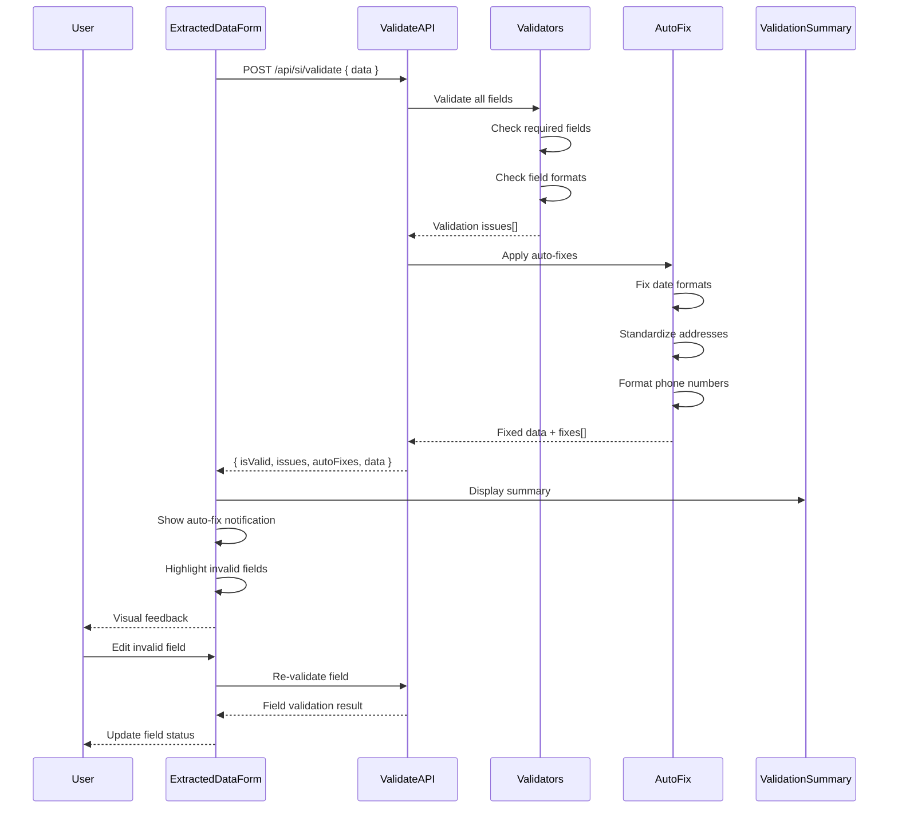

# Implementation Plan: Validate and Auto-fix Extracted SI Data

## 1. Feature Overview

This feature enables automatic validation of extracted Shipping Instruction data against business rules and IRIS API requirements, with intelligent auto-correction of common formatting issues. The goal is to reduce manual data correction efforts and speed up the submission process for external customers.

**Primary User Role:** External Customer

## 2. Component Analysis & Reuse Strategy

**Existing Components (from Story 1):**
- `ExtractedDataForm` (`src/components/features/si-upload/ExtractedDataForm.tsx`) - **MODIFY** to display validation results and auto-fix notifications
- `Card` (`src/components/ui/Card.tsx`) - **REUSE** for validation summary cards
- `Input` (`src/components/ui/Input.tsx`) - **MODIFY** to show inline validation errors
- `Button` (`src/components/ui/Button.tsx`) - **REUSE** for validation actions

**New Components Required:**
- `ValidationSummaryCard` - Display overall validation status and issues count
- `ValidationBadge` - Show field-level validation status (success, warning, error)
- `AutoFixNotification` - Display what fields were auto-corrected
- `InlineFieldError` - Show validation errors next to form fields
- `ValidationToast` - Toast notifications for validation events

**Justification:** We'll extend the existing form component with validation capabilities and create new UI components for validation feedback following the gaming aesthetic.

## 3. Affected Files

**Backend & API:**
- `[CREATE] src/app/api/si/validate/route.ts` - Validate SI data endpoint
- `[CREATE] src/lib/validation/si-validators.ts` - Field-level validation rules
- `[CREATE] src/lib/validation/auto-fix.ts` - Auto-fix logic for common issues
- `[CREATE] src/lib/validation/iris-rules.ts` - IRIS API validation requirements
- `[MODIFY] src/lib/validation/si-schema.ts` - Enhance Zod schema with validation rules

**Frontend Components:**
- `[CREATE] src/components/features/validation/ValidationSummaryCard.tsx`
- `[CREATE] src/components/features/validation/ValidationBadge.tsx`
- `[CREATE] src/components/features/validation/AutoFixNotification.tsx`
- `[CREATE] src/components/features/validation/InlineFieldError.tsx`
- `[CREATE] src/components/ui/Toast.tsx` - Reusable toast notification component
- `[MODIFY] src/components/features/si-upload/ExtractedDataForm.tsx` - Add validation integration
- `[MODIFY] src/components/ui/Input.tsx` - Add error state styling

**Types & Interfaces:**
- `[CREATE] src/types/validation.ts` - Validation result types
- `[MODIFY] src/types/si.ts` - Add validation metadata to SI types

**Testing:**
- `[CREATE] src/lib/validation/si-validators.test.ts`
- `[CREATE] src/lib/validation/auto-fix.test.ts`
- `[CREATE] src/components/features/validation/ValidationSummaryCard.test.tsx`
- `[CREATE] src/components/features/validation/ValidationSummaryCard.visual.spec.ts`
- `[CREATE] src/components/features/validation/AutoFixNotification.test.tsx`
- `[CREATE] src/components/features/validation/AutoFixNotification.visual.spec.ts`
- `[CREATE] src/app/api/si/validate/route.test.ts`

**Configuration:**
- `[CREATE] src/lib/constants/validation-rules.ts` - Validation rule definitions
- `[MODIFY] package.json` - Add date parsing library (date-fns)

## 4. Component Breakdown

### New Components

#### `ValidationSummaryCard` (Client Component)
- **Location:** `src/components/features/validation/ValidationSummaryCard.tsx`
- **Type:** Client Component (interactive expansion/collapse)
- **Responsibility:** Display overall validation status with issue counts and expandable details
- **Props:**
  ```typescript
  interface ValidationSummaryCardProps {
    totalFields: number;
    validFields: number;
    errorsCount: number;
    warningsCount: number;
    autoFixedCount: number;
    issues: ValidationIssue[];
    onFieldClick?: (fieldName: string) => void;
  }
  ```
- **Child Components:** `Card`, `ValidationBadge`

#### `ValidationBadge` (Client Component)
- **Location:** `src/components/features/validation/ValidationBadge.tsx`
- **Type:** Client Component
- **Responsibility:** Display validation status with gaming-themed icons and colors
- **Props:**
  ```typescript
  interface ValidationBadgeProps {
    status: 'valid' | 'warning' | 'error' | 'auto-fixed';
    size?: 'sm' | 'md' | 'lg';
    showIcon?: boolean;
    showLabel?: boolean;
  }
  ```

#### `AutoFixNotification` (Client Component)
- **Location:** `src/components/features/validation/AutoFixNotification.tsx`
- **Type:** Client Component (animated entry/exit)
- **Responsibility:** Display notifications for auto-corrected fields
- **Props:**
  ```typescript
  interface AutoFixNotificationProps {
    fixes: Array<{
      field: string;
      oldValue: string;
      newValue: string;
      reason: string;
    }>;
    onDismiss?: () => void;
    autoClose?: boolean;
    duration?: number;
  }
  ```
- **Child Components:** `Card`, `Button`

#### `InlineFieldError` (Client Component)
- **Location:** `src/components/features/validation/InlineFieldError.tsx`
- **Type:** Client Component
- **Responsibility:** Display validation errors and warnings inline with form fields
- **Props:**
  ```typescript
  interface InlineFieldErrorProps {
    message: string;
    type: 'error' | 'warning';
    suggestion?: string;
  }
  ```

#### `Toast` (Client Component)
- **Location:** `src/components/ui/Toast.tsx`
- **Type:** Client Component (portal-based overlay)
- **Responsibility:** Reusable toast notification system with gaming theme
- **Props:**
  ```typescript
  interface ToastProps {
    message: string;
    type: 'success' | 'error' | 'warning' | 'info';
    duration?: number;
    onClose?: () => void;
  }
  ```

### Modified Components

#### `ExtractedDataForm` (MODIFY)
- **Changes Required:**
  - Integrate validation on data load
  - Display validation badges next to field labels
  - Show inline errors below invalid fields
  - Add "Re-validate" button
  - Display auto-fix notifications
  - Highlight auto-fixed fields temporarily

#### `Input` (MODIFY)
- **Changes Required:**
  - Add error state styling (red neon border)
  - Add warning state styling (orange neon border)
  - Add success state styling (green neon border)
  - Support inline error message display

## 5. Design Specifications

**Note:** No Figma link provided. Following the gaming design system with validation-specific colors.

### Color Palette

| Design Color | Semantic Purpose | Element | Implementation Method |
|--------------|-----------------|---------|------------------------|
| #000000 | Primary background | Page background | Direct hex value (bg-[#000000]) |
| #18181B | Card background | Validation cards | Direct hex value (bg-[#18181B]) |
| #10B981 | Success state | Valid fields, badges | Direct hex value (#10B981) |
| #EF4444 | Error state | Invalid fields, error badges | Direct hex value (#EF4444) |
| #F97316 | Warning state | Warning badges, suggestions | Direct hex value (#F97316) |
| #22D3EE | Auto-fix indicator | Auto-corrected field highlight | Direct hex value (#22D3EE) |
| #A855F7 | Info state | Information badges | Direct hex value (#A855F7) |
| #FFFFFF | Primary text | Labels, headings | Direct hex value (#FFFFFF) |
| #A1A1AA | Secondary text | Helper text | Direct hex value (#A1A1AA) |
| #27272A | Hover/focus state | Interactive elements | Direct hex value (#27272A) |

### Spacing & Layout

- **Validation summary padding:** 24px (p-6)
- **Badge spacing:** 8px (gap-2)
- **Inline error margin:** 8px top (mt-2)
- **Toast padding:** 16px (p-4)
- **Auto-fix notification padding:** 20px (p-5)
- **Border radius:** 8px (rounded-lg)
- **Badge border radius:** 16px (rounded-full)

### Typography

- **Validation summary title:** 20px / 600 / 1.3 line-height
- **Badge text:** 12px / 500 / 1
- **Error message:** 14px / 400 / 1.4 line-height
- **Auto-fix details:** 14px / 400 / 1.5 line-height
- **Field labels:** 14px / 500 / 1.4 line-height

### Visual Hierarchy

```
Validation Section
├── ValidationSummaryCard (bg-[#18181B] border-[#22D3EE]/30)
│   ├── Status Header (flex items-center justify-between)
│   │   ├── Title + Badge counts
│   │   └── Expand/Collapse icon
│   └── Issues List (expandable)
│       └── Issue items (clickable, hover effect)
├── AutoFixNotification (bg-[#18181B] border-[#22D3EE])
│   ├── Header (text-[#22D3EE] with icon)
│   ├── Fix details list
│   └── Dismiss button
└── Form Fields with Validation
    ├── Label + ValidationBadge
    ├── Input (with colored border based on status)
    └── InlineFieldError (if invalid)
```

### Responsive Behavior

- **Mobile (<640px):** Stack summary and form vertically, reduce padding
- **Tablet (≥640px):** Side-by-side for badges, maintain vertical layout
- **Desktop (≥768px):** Summary panel can float or dock to side
- **Large (≥1024px):** Full layout with expanded summary panel

### Visual Verification Checklist

- [ ] Success badge uses green (#10B981) with glow effect
- [ ] Error badge uses red (#EF4444) with glow effect
- [ ] Warning badge uses orange (#F97316)
- [ ] Auto-fix notification has cyan border (#22D3EE)
- [ ] Invalid input fields have red neon border (#EF4444)
- [ ] Auto-fixed fields briefly show cyan highlight (#22D3EE)
- [ ] Validation summary card has dark background (#18181B)
- [ ] All hover states show appropriate glow effects
- [ ] Badge counts are clearly visible
- [ ] Toast notifications appear with slide-in animation

## 6. Data Flow & State Management

### TypeScript Types

**Location:** `src/types/validation.ts`

```typescript
export type ValidationSeverity = 'error' | 'warning' | 'info';
export type ValidationStatus = 'valid' | 'invalid' | 'warning' | 'auto-fixed';

export interface ValidationIssue {
  field: string;
  severity: ValidationSeverity;
  message: string;
  code: string;
  suggestion?: string;
}

export interface AutoFixResult {
  field: string;
  oldValue: any;
  newValue: any;
  reason: string;
}

export interface ValidationResult {
  isValid: boolean;
  issues: ValidationIssue[];
  autoFixes: AutoFixResult[];
  metadata: {
    totalFields: number;
    validFields: number;
    errorCount: number;
    warningCount: number;
    autoFixCount: number;
  };
}

export interface FieldValidation {
  status: ValidationStatus;
  message?: string;
  suggestion?: string;
}
```

**Location:** `src/types/si.ts` (modifications)

```typescript
// Add to existing ShippingInstructionData
export interface ShippingInstructionData {
  // ... existing fields
  validation?: {
    status: ValidationStatus;
    lastValidated: Date;
    issues: ValidationIssue[];
    autoFixes: AutoFixResult[];
  };
}
```

### Data Fetching Strategy

**Client-Side Fetching:**
- POST `/api/si/validate` with extracted SI data
- Automatic validation after extraction completes
- Manual re-validation on user request
- Validation triggered on field blur/change (debounced)

**State Management:**
- Local component state using `useState` for:
  - Current validation result
  - Visible auto-fix notifications
  - Field-level validation status
  - Toast notifications
- Consider Zustand for global validation state if needed across multiple pages (not required for Phase 1)

### Validation Flow

```
Extracted SI Data
  ↓
POST /api/si/validate { data }
  ↓
Server validates all fields
  ↓
Server applies auto-fixes where possible
  ↓
Return { isValid, issues, autoFixes }
  ↓
Display ValidationSummaryCard
  ↓
Show AutoFixNotification (if fixes applied)
  ↓
Highlight invalid fields with InlineFieldError
  ↓
User corrects remaining issues
  ↓
Re-validate on change
```

## 7. API Endpoints & Contracts

### POST /api/si/validate

**Route Path:** `src/app/api/si/validate/route.ts`

**HTTP Method:** POST

**Request:**
```typescript
{
  data: ShippingInstructionData,
  options?: {
    autoFix?: boolean, // default: true
    strictMode?: boolean // default: false
  }
}
```

**Response (Success):**
```typescript
{
  success: true,
  isValid: boolean,
  data: ShippingInstructionData, // with auto-fixes applied
  validation: {
    issues: ValidationIssue[],
    autoFixes: AutoFixResult[],
    metadata: {
      totalFields: number,
      validFields: number,
      errorCount: number,
      warningCount: number,
      autoFixCount: number
    }
  }
}
```

**Response (Error):**
```typescript
{
  success: false,
  error: string,
  code: 'INVALID_DATA' | 'VALIDATION_FAILED'
}
```

**Status Codes:**
- 200: Validation completed (may have issues)
- 400: Invalid request format
- 500: Server error during validation

**Core Logic:**
1. Validate all required fields are present
2. Validate field formats (dates, phone numbers, addresses)
3. Validate against IRIS API requirements
4. Apply auto-fixes for common issues:
   - Date format standardization
   - Address formatting
   - Phone number formatting
   - Capitalization fixes
   - Whitespace trimming
5. Calculate validation metadata
6. Return enhanced data with validation results

## 8. Integration Diagram



## 9. Styling

### Design to Implementation Mapping

| Design Element | Tailwind/CSS Implementation |
|----------------|---------------------------|
| Validation summary card | `className="bg-[#18181B] border border-[#22D3EE]/30 rounded-lg p-6"` |
| Success badge | `className="bg-[#10B981]/10 border border-[#10B981] text-[#10B981] px-3 py-1 rounded-full text-xs font-medium"` |
| Error badge | `className="bg-[#EF4444]/10 border border-[#EF4444] text-[#EF4444] px-3 py-1 rounded-full text-xs font-medium"` |
| Warning badge | `className="bg-[#F97316]/10 border border-[#F97316] text-[#F97316] px-3 py-1 rounded-full text-xs font-medium"` |
| Auto-fix badge | `className="bg-[#22D3EE]/10 border border-[#22D3EE] text-[#22D3EE] px-3 py-1 rounded-full text-xs font-medium"` |
| Invalid input border | `className="border-2 border-[#EF4444] shadow-lg shadow-[#EF4444]/30"` |
| Valid input border | `className="border border-[#10B981]/50"` |
| Inline error message | `className="text-[#EF4444] text-sm mt-2 flex items-center gap-2"` |
| Auto-fix notification | `className="bg-[#18181B] border-2 border-[#22D3EE] rounded-lg p-5 shadow-lg shadow-[#22D3EE]/50"` |
| Toast success | `className="bg-[#10B981] text-[#000000] px-4 py-3 rounded-lg font-medium shadow-lg"` |
| Toast error | `className="bg-[#EF4444] text-[#FFFFFF] px-4 py-3 rounded-lg font-medium shadow-lg"` |

### Visual Implementation Checklist

- [ ] Success badges have green background (#10B981) with glow
- [ ] Error badges have red background (#EF4444) with glow
- [ ] Warning badges have orange background (#F97316)
- [ ] Auto-fix notification has cyan border (#22D3EE) with strong glow
- [ ] Invalid inputs have red neon border with shadow
- [ ] Valid inputs have subtle green border
- [ ] Badge counts are displayed with correct colors
- [ ] All badges use rounded-full shape
- [ ] Inline errors have icon + message layout
- [ ] Toast notifications slide in from top-right
- [ ] Auto-fix fields briefly flash cyan highlight animation
- [ ] Hover states on issue items show pointer cursor

### Validation State Colors

| State | Border Color | Background | Glow |
|-------|-------------|------------|------|
| Valid | #10B981/50 | #18181B | None |
| Error | #EF4444 | #18181B | #EF4444/30 |
| Warning | #F97316 | #18181B | #F97316/30 |
| Auto-fixed | #22D3EE | #18181B | #22D3EE/50 (temporary) |

### Responsiveness

- **Mobile:** Stack badges vertically, reduce padding
- **Tablet:** Horizontal badge layout
- **Desktop:** Full validation panel display
- **Large:** Enhanced spacing and larger summary panel

## 10. Testing Strategy

### Unit Tests

**File:** `src/lib/validation/si-validators.test.ts`
- Test required field validation
- Test date format validation
- Test phone number validation
- Test address validation
- Test email validation
- Test cargo weight/volume validation
- Test business rule validations

**File:** `src/lib/validation/auto-fix.test.ts`
- Test date format standardization
- Test phone number formatting
- Test address standardization
- Test whitespace trimming
- Test capitalization fixes
- Test that auto-fix doesn't over-correct

**File:** `src/app/api/si/validate/route.test.ts`
- Test successful validation
- Test validation with errors
- Test validation with warnings
- Test auto-fix application
- Test validation metadata calculation

### Component Tests

**File:** `src/components/features/validation/ValidationSummaryCard.test.tsx`
- Test summary display with various issue counts
- Test expand/collapse functionality
- Test issue list rendering
- Test click handling for field navigation

**File:** `src/components/features/validation/ValidationBadge.test.tsx`
- Test badge rendering for each status
- Test size variants
- Test with/without icons and labels

**File:** `src/components/features/validation/AutoFixNotification.test.tsx`
- Test notification display with fixes
- Test dismiss functionality
- Test auto-close behavior

**File:** `src/components/features/validation/InlineFieldError.test.tsx`
- Test error message display
- Test warning message display
- Test suggestion display

### Visual Tests (Playwright)

**File:** `src/components/features/validation/ValidationSummaryCard.visual.spec.ts`
- Test exact colors for success/error/warning badges
- Test spacing between badge elements
- Test card background and border colors
- Test hover effects on issue items
- Test across all viewports
- Use data-testid="validation-summary-card"

**File:** `src/components/features/validation/AutoFixNotification.visual.spec.ts`
- Test cyan border (#22D3EE) color exactly
- Test glow effect (shadow property)
- Test notification layout and spacing
- Test typography for fix details
- Use data-testid="auto-fix-notification"

**File:** `src/components/features/validation/ValidationBadge.visual.spec.ts`
- Test badge colors for each state (success, error, warning, auto-fixed)
- Test badge sizes (sm, md, lg)
- Test border radius (rounded-full)
- Test text size and weight
- Use data-testid="validation-badge-{status}"

### E2E Tests (Optional for Phase 1)

Will implement in Phase 2 with full integration testing.

## 11. Accessibility (A11y) Considerations

- **Validation Badges:** Use `aria-label` to describe validation status
- **Error Messages:** Associate with inputs using `aria-describedby`
- **Auto-fix Notifications:** Use `role="alert"` for screen reader announcements
- **Toast Notifications:** Use `aria-live="polite"` for non-critical toasts
- **Field Status:** Use `aria-invalid="true"` for invalid fields
- **Keyboard Navigation:** All validation summary items keyboard accessible
- **Color Independence:** Don't rely solely on color - use icons/text
- **Focus Management:** Move focus to first invalid field on validation
- **Screen Reader:** Announce validation status changes

## 12. Security Considerations

- **Input Sanitization:** Sanitize all auto-corrected values to prevent XSS
- **Validation Logic:** Server-side validation only - never trust client
- **Auto-fix Limits:** Prevent infinite loops in auto-fix logic
- **Rate Limiting:** Limit validation requests to prevent API abuse
- **Data Privacy:** Don't log sensitive SI data in validation errors
- **Error Messages:** Avoid exposing internal logic in error messages
- **Injection Prevention:** Sanitize regex patterns used in validation
- **Business Rules:** Ensure validation rules match IRIS API requirements exactly

## 13. Implementation Steps

### Phase 1: UI Implementation with Mock Data

**1. Setup & Dependencies:**

- [ ] Install validation libraries: `npm install date-fns libphonenumber-js`
- [ ] Create validation rule configuration files
- [ ] Set up mock validation responses
- [ ] Create mock auto-fix scenarios

**2. Types & Validation Rules:**

- [ ] Define `ValidationIssue`, `AutoFixResult`, `ValidationResult` types in `src/types/validation.ts`
- [ ] Add validation metadata to `ShippingInstructionData` in `src/types/si.ts`
- [ ] Create validation rule constants in `src/lib/constants/validation-rules.ts`
- [ ] Create mock validation data in `src/mocks/validation-mock-data.ts`

**3. Base UI Components:**

- [ ] Create `src/components/ui/Toast.tsx` with gaming theme
  - Implement portal-based rendering
  - Add slide-in animation
  - Add auto-close functionality
  - Add data-testid="toast-{type}"
- [ ] Modify `src/components/ui/Input.tsx`
  - Add error state styling (red neon border with glow)
  - Add warning state styling (orange neon border)
  - Add success state styling (green subtle border)
  - Add support for inline error display
  - Add data-testid="input-{status}" to root element

**4. Validation Components (Mock Data):**

- [ ] Create `src/components/features/validation/ValidationBadge.tsx`
  - Implement all status variants (valid, error, warning, auto-fixed)
  - Implement size variants (sm, md, lg)
  - Add gaming-themed icons
  - Use direct hex values for all colors
  - Add data-testid="validation-badge-{status}"
- [ ] Create `src/components/features/validation/InlineFieldError.tsx`
  - Display error/warning messages
  - Show suggestion text if provided
  - Add appropriate icons
  - Use red (#EF4444) or orange (#F97316) colors
  - Add data-testid="inline-field-error"
- [ ] Create `src/components/features/validation/AutoFixNotification.tsx`
  - Display list of auto-fixes
  - Show old vs new values
  - Add dismiss functionality
  - Implement auto-close with timer
  - Use cyan border (#22D3EE) with strong glow
  - Add data-testid="auto-fix-notification"
- [ ] Create `src/components/features/validation/ValidationSummaryCard.tsx`
  - Display validation metadata (counts)
  - List all validation issues
  - Implement expand/collapse
  - Add click-to-navigate functionality
  - Configure to use mock validation results
  - Add data-testid="validation-summary-card"

**5. Form Integration:**

- [ ] Modify `src/components/features/si-upload/ExtractedDataForm.tsx`
  - Add validation trigger after data loads
  - Display ValidationSummaryCard at top
  - Show ValidationBadge next to each field label
  - Display InlineFieldError for invalid fields
  - Show AutoFixNotification when auto-fixes applied
  - Highlight auto-fixed fields with cyan animation
  - Add "Re-validate" button
  - Configure to use mock validation data
  - Add data-testid for validation elements

**6. Styling Verification:**

- [ ] Verify success badge uses exact #10B981 color with 10% opacity background
- [ ] Verify error badge uses exact #EF4444 color with 10% opacity background
- [ ] Verify warning badge uses exact #F97316 color with 10% opacity background
- [ ] Verify auto-fix notification has #22D3EE border with glow shadow
- [ ] Verify invalid input borders are #EF4444 with 2px width
- [ ] Verify all badges use rounded-full shape
- [ ] Verify badge text is 12px with 500 weight
- [ ] Verify inline error messages are 14px in #EF4444
- [ ] Verify auto-fix field highlight animation (cyan flash)
- [ ] Verify toast positioning (top-right corner)
- [ ] Verify all spacing values match design spec

**7. UI Testing (Mock Data):**

- [ ] Write component tests for `ValidationBadge.test.tsx`
- [ ] Write component tests for `InlineFieldError.test.tsx`
- [ ] Write component tests for `AutoFixNotification.test.tsx`
- [ ] Write component tests for `ValidationSummaryCard.test.tsx`
- [ ] Write component tests for `Toast.test.tsx`
- [ ] Update tests for modified `ExtractedDataForm.test.tsx`

**8. Playwright Visual Tests:**

- [ ] Create `src/components/features/validation/ValidationBadge.visual.spec.ts`
  - Test exact badge colors for all states using RGB assertions
  - Test badge shapes (rounded-full)
  - Test badge sizes
  - Test text size and weight
  - Test across all viewports
  
- [ ] Create `src/components/features/validation/ValidationSummaryCard.visual.spec.ts`
  - Test card background (#18181B) and border (#22D3EE/30)
  - Test badge layout and spacing
  - Test issue list rendering
  - Test expand/collapse states
  - Test hover effects on issues
  - Test across all viewports

- [ ] Create `src/components/features/validation/AutoFixNotification.visual.spec.ts`
  - Test cyan border (#22D3EE) with 2px width
  - Test glow shadow effect
  - Test notification layout and typography
  - Test spacing between fix items
  - Test across all viewports

**9. Accessibility & Manual Testing:**

- [ ] Test screen reader announcements for validation results
- [ ] Test keyboard navigation through validation issues
- [ ] Test focus management (move to first error)
- [ ] Test color contrast for all badge colors
- [ ] Test that icons don't rely solely on color
- [ ] Manual testing of validation flow
- [ ] Cross-browser testing

### Phase 2: API Integration with Real Data

**10. Backend Validation Logic:**

- [ ] Create `src/lib/validation/si-validators.ts`
  - Implement required field validators
  - Implement date format validators
  - Implement phone number validators
  - Implement email validators
  - Implement address validators
  - Implement business rule validators
- [ ] Create `src/lib/validation/iris-rules.ts`
  - Define IRIS API validation requirements
  - Implement IRIS-specific validators
  - Document each rule with source reference
- [ ] Create `src/lib/validation/auto-fix.ts`
  - Implement date format standardization (ISO 8601)
  - Implement phone number formatting (E.164)
  - Implement address standardization
  - Implement whitespace trimming
  - Implement capitalization fixes
  - Add confidence scoring for auto-fixes
- [ ] Update `src/lib/validation/si-schema.ts`
  - Enhance Zod schema with validation rules
  - Add custom validators
  - Add error messages

**11. API Endpoint:**

- [ ] Create `src/app/api/si/validate/route.ts`
  - Implement validation endpoint
  - Call field validators
  - Apply auto-fix logic
  - Calculate validation metadata
  - Return validation results with enhanced data
  - Add rate limiting
  - Add error handling

**12. Integration:**

- [ ] Update `ExtractedDataForm` to call real validation API
- [ ] Replace mock validation data with real API responses
- [ ] Implement debounced field-level re-validation
- [ ] Implement full form re-validation button
- [ ] Handle validation errors properly
- [ ] Implement loading states during validation

**13. Backend Testing:**

- [ ] Write unit tests for all validators in `si-validators.test.ts`
- [ ] Write unit tests for auto-fix logic in `auto-fix.test.ts`
- [ ] Write unit tests for IRIS rules in `iris-rules.test.ts`
- [ ] Write API tests for validation endpoint
- [ ] Test with various invalid data scenarios
- [ ] Test auto-fix edge cases

**14. Integration Testing:**

- [ ] Update component tests to use real validation API (mocked fetch)
- [ ] Test validation error scenarios
- [ ] Test auto-fix application
- [ ] Test re-validation flow
- [ ] End-to-end test: extract → validate → fix → re-validate

**15. Performance & Optimization:**

- [ ] Optimize validation performance (parallel validation where possible)
- [ ] Implement field-level validation caching
- [ ] Add rate limiting for validation endpoint
- [ ] Optimize auto-fix algorithm performance
- [ ] Test validation with large data sets

**16. Final Documentation & Polishing:**

- [ ] Document all validation rules with examples
- [ ] Document auto-fix logic and limitations
- [ ] Add JSDoc comments to all validators
- [ ] Create validation rule reference guide
- [ ] Final accessibility audit
- [ ] Final cross-browser testing
- [ ] Code review and refactoring

## References

- **Zod Validation:** https://zod.dev/
- **date-fns:** https://date-fns.org/
- **libphonenumber-js:** https://gitlab.com/catamphetamine/libphonenumber-js
- **IRIS API Documentation:** (To be provided)
- **Gaming Design System:** `.github/instructions/design-system.instructions.md`
- **Technical Standards:** `.github/instructions/technical.instructions.md`
- **User Story 1 Plan:** `docs/plans/01-upload-and-extract-si-data-from-pdf-plan.md`
