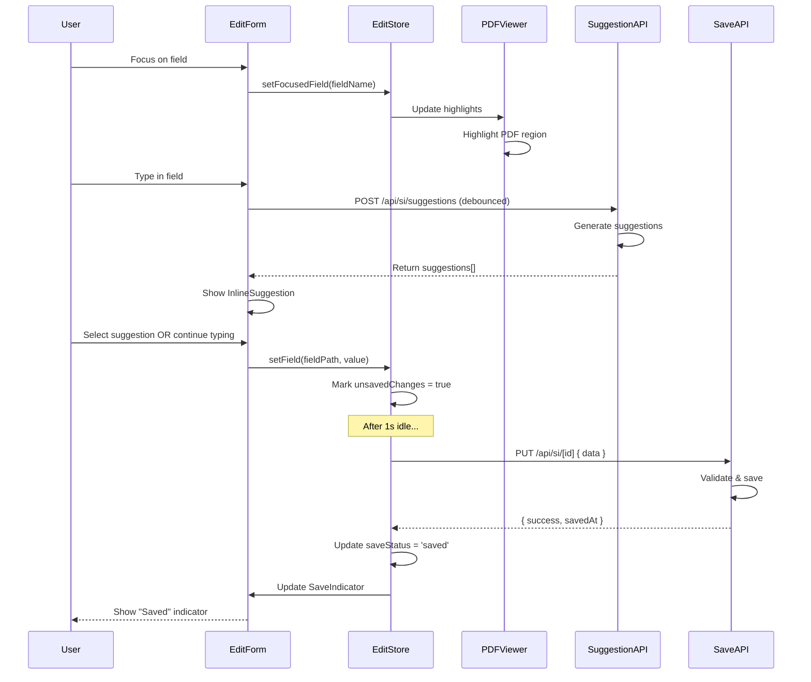

# Implementation Plan: Manually Edit SI Data with PDF Reference

## 1. Feature Overview

This feature enables external customers to manually edit extracted Shipping Instruction data while viewing the original PDF side-by-side. Inline suggestions guide users toward correct formats, and the system provides real-time validation feedback. The goal is to make manual corrections intuitive and efficient by providing visual reference to the source document.

**Primary User Role:** External Customer

## 2. Component Analysis & Reuse Strategy

**Existing Components:**
- `ExtractedDataForm` (`src/components/features/si-upload/ExtractedDataForm.tsx`) - **MODIFY** to support inline editing mode
- `Input` (`src/components/ui/Input.tsx`) - **REUSE** for form fields
- `Card` (`src/components/ui/Card.tsx`) - **REUSE** for layout containers
- `Button` (`src/components/ui/Button.tsx`) - **REUSE** for actions
- `ValidationBadge` (`src/components/features/validation/ValidationBadge.tsx`) - **REUSE** for field status
- `InlineFieldError` (`src/components/features/validation/InlineFieldError.tsx`) - **REUSE** for errors

**New Components Required:**
- `PDFViewer` - Display PDF with page navigation and zoom
- `SideBySideLayout` - Split-screen layout for PDF and form
- `InlineSuggestion` - Dropdown/popover with format suggestions
- `FieldHighlighter` - Highlight PDF regions corresponding to edited field
- `SaveIndicator` - Real-time save status indicator

**Justification:** Reuse existing form and validation components while adding PDF viewing capability and enhanced editing experience with suggestions.

## 3. Affected Files

**Backend & API:**
- `[CREATE] src/app/api/si/pdf/[fileId]/route.ts` - Serve PDF files securely
- `[CREATE] src/app/api/si/suggestions/route.ts` - Generate inline suggestions
- `[CREATE] src/lib/suggestions/generator.ts` - Suggestion logic
- `[CREATE] src/lib/pdf/page-mapper.ts` - Map fields to PDF page locations

**Frontend Components:**
- `[CREATE] src/components/features/pdf-editor/PDFViewer.tsx` - PDF display component
- `[CREATE] src/components/features/pdf-editor/SideBySideLayout.tsx` - Split layout
- `[CREATE] src/components/features/pdf-editor/InlineSuggestion.tsx` - Suggestion dropdown
- `[CREATE] src/components/features/pdf-editor/FieldHighlighter.tsx` - PDF highlighting
- `[CREATE] src/components/features/pdf-editor/SaveIndicator.tsx` - Save status
- `[MODIFY] src/components/features/si-upload/ExtractedDataForm.tsx` - Add editing mode
- `[CREATE] src/components/ui/Dropdown.tsx` - Reusable dropdown component
- `[CREATE] src/components/ui/Tooltip.tsx` - Reusable tooltip component

**Pages:**
- `[CREATE] src/app/si/edit/[id]/page.tsx` - Dedicated edit page with PDF viewer

**Types & Interfaces:**
- `[CREATE] src/types/pdf.ts` - PDF viewer types
- `[CREATE] src/types/suggestions.ts` - Suggestion types
- `[MODIFY] src/types/si.ts` - Add edit metadata

**State Management:**
- `[CREATE] src/stores/edit-session.ts` - Zustand store for edit session state

**Testing:**
- `[CREATE] src/components/features/pdf-editor/PDFViewer.test.tsx`
- `[CREATE] src/components/features/pdf-editor/PDFViewer.visual.spec.ts`
- `[CREATE] src/components/features/pdf-editor/SideBySideLayout.test.tsx`
- `[CREATE] src/components/features/pdf-editor/SideBySideLayout.visual.spec.ts`
- `[CREATE] src/components/features/pdf-editor/InlineSuggestion.test.tsx`
- `[CREATE] src/components/features/pdf-editor/InlineSuggestion.visual.spec.ts`
- `[CREATE] src/lib/suggestions/generator.test.ts`
- `[CREATE] src/app/api/si/suggestions/route.test.ts`

**Configuration:**
- `[MODIFY] package.json` - Add PDF.js library: `pdfjs-dist`, `react-pdf`

## 4. Component Breakdown

### New Components

#### `PDFViewer` (Client Component)
- **Location:** `src/components/features/pdf-editor/PDFViewer.tsx`
- **Type:** Client Component (PDF rendering, canvas manipulation)
- **Responsibility:** Render PDF with page navigation, zoom, and highlighting
- **Props:**
  ```typescript
  interface PDFViewerProps {
    fileId: string;
    pdfUrl: string;
    currentPage?: number;
    onPageChange?: (page: number) => void;
    highlightedAreas?: PDFHighlight[];
    zoom?: number;
  }
  ```
- **Child Components:** Navigation controls, zoom controls

#### `SideBySideLayout` (Client Component)
- **Location:** `src/components/features/pdf-editor/SideBySideLayout.tsx`
- **Type:** Client Component (resizable panels)
- **Responsibility:** Manage split-screen layout with resizable divider
- **Props:**
  ```typescript
  interface SideBySideLayoutProps {
    leftPanel: React.ReactNode;
    rightPanel: React.ReactNode;
    defaultSplit?: number; // percentage (0-100)
    minPanelWidth?: number;
    onSplitChange?: (split: number) => void;
  }
  ```

#### `InlineSuggestion` (Client Component)
- **Location:** `src/components/features/pdf-editor/InlineSuggestion.tsx`
- **Type:** Client Component (dropdown interaction)
- **Responsibility:** Display contextual suggestions for field editing
- **Props:**
  ```typescript
  interface InlineSuggestionProps {
    fieldName: string;
    currentValue: string;
    suggestions: Suggestion[];
    onSelect: (value: string) => void;
    position?: 'top' | 'bottom';
  }
  ```
- **Child Components:** `Dropdown`, `Tooltip`

#### `FieldHighlighter` (Client Component)
- **Location:** `src/components/features/pdf-editor/FieldHighlighter.tsx`
- **Type:** Client Component (canvas overlay)
- **Responsibility:** Highlight PDF regions corresponding to focused field
- **Props:**
  ```typescript
  interface FieldHighlighterProps {
    pdfCanvas: HTMLCanvasElement;
    highlights: PDFHighlight[];
    color?: string;
  }
  ```

#### `SaveIndicator` (Client Component)
- **Location:** `src/components/features/pdf-editor/SaveIndicator.tsx`
- **Type:** Client Component (animated status)
- **Responsibility:** Show real-time save status (saving, saved, error)
- **Props:**
  ```typescript
  interface SaveIndicatorProps {
    status: 'idle' | 'saving' | 'saved' | 'error';
    lastSaved?: Date;
    errorMessage?: string;
  }
  ```

### Modified Components

#### `ExtractedDataForm` (MODIFY)
- **Changes Required:**
  - Add "editing mode" with enhanced field focus states
  - Integrate InlineSuggestion for each field
  - Add debounced auto-save on change
  - Show SaveIndicator in form header
  - Trigger PDF highlighting on field focus
  - Add keyboard shortcuts (Ctrl+S to save)

## 5. Design Specifications

**Note:** No Figma link provided. Following gaming design system with PDF editing enhancements.

### Color Palette

| Design Color | Semantic Purpose | Element | Implementation Method |
|--------------|-----------------|---------|------------------------|
| #000000 | Primary background | Page background | Direct hex value (bg-[#000000]) |
| #18181B | Panel background | PDF viewer, form panels | Direct hex value (bg-[#18181B]) |
| #27272A | Hover/active state | Suggestion items, buttons | Direct hex value (#27272A) |
| #22D3EE | Primary accent | Active field, PDF highlight | Direct hex value (#22D3EE) |
| #A855F7 | Secondary accent | Suggestion indicators | Direct hex value (#A855F7) |
| #10B981 | Success state | Saved indicator | Direct hex value (#10B981) |
| #F97316 | Warning | Unsaved changes | Direct hex value (#F97316) |
| #FFFFFF | Primary text | Labels, content | Direct hex value (#FFFFFF) |
| #A1A1AA | Secondary text | Helper text, timestamps | Direct hex value (#A1A1AA) |
| #52525B | Divider color | Split panel divider | Direct hex value (#52525B) |

### Spacing & Layout

- **Panel gap:** 2px (gap-0.5) for resizable divider
- **PDF viewer padding:** 16px (p-4)
- **Form panel padding:** 24px (p-6)
- **Suggestion dropdown padding:** 12px (p-3)
- **Save indicator padding:** 8px 16px (px-4 py-2)
- **Split ratio default:** 50% PDF / 50% Form
- **Min panel width:** 320px
- **Max zoom:** 200%
- **Min zoom:** 50%

### Typography

- **Panel titles:** 20px / 600 / 1.3 line-height
- **PDF page indicator:** 14px / 500 / 1.4 line-height
- **Suggestion text:** 14px / 400 / 1.5 line-height
- **Save indicator:** 12px / 500 / 1.2 line-height
- **Tooltip text:** 12px / 400 / 1.3 line-height

### Visual Hierarchy

```
Edit Page Container (bg-[#000000])
└── SideBySideLayout (h-screen)
    ├── Left Panel (PDF Viewer)
    │   ├── Header (page controls, zoom)
    │   ├── PDF Canvas (with highlights)
    │   └── Footer (page info)
    ├── Resizable Divider (bg-[#52525B] w-0.5 cursor-col-resize)
    └── Right Panel (Form Editor)
        ├── Header
        │   ├── Title
        │   └── SaveIndicator
        ├── ExtractedDataForm (with suggestions)
        │   └── Fields with InlineSuggestion
        └── Action Buttons
```

### PDF Highlighting

- **Highlight color:** #22D3EE (cyan) with 20% opacity
- **Highlight border:** 2px solid #22D3EE
- **Animation:** Fade in/out on field focus change
- **Multiple highlights:** Same field can have multiple regions

### Responsive Behavior

- **Mobile (<640px):** Stack vertically - PDF on top, form below (no side-by-side)
- **Tablet (≥640px):** Side-by-side with 40% PDF / 60% Form split
- **Desktop (≥768px):** Side-by-side with 50% / 50% split, resizable
- **Large (≥1024px):** Side-by-side with enhanced controls

### Visual Verification Checklist

- [ ] Split panel layout renders correctly
- [ ] Resizable divider is visible (#52525B) and draggable
- [ ] PDF renders clearly with navigation controls
- [ ] Highlighted regions show cyan overlay (#22D3EE with 20% opacity)
- [ ] Active field has cyan border (#22D3EE)
- [ ] Suggestions dropdown has dark background (#18181B)
- [ ] Save indicator changes color based on status (green for saved)
- [ ] Hover states on suggestions show background change
- [ ] Zoom controls function properly
- [ ] Page navigation is intuitive

## 6. Data Flow & State Management

### TypeScript Types

**Location:** `src/types/pdf.ts`

```typescript
export interface PDFHighlight {
  page: number;
  x: number;
  y: number;
  width: number;
  height: number;
  fieldName: string;
}

export interface PDFViewerState {
  currentPage: number;
  totalPages: number;
  zoom: number;
  isLoading: boolean;
}
```

**Location:** `src/types/suggestions.ts`

```typescript
export interface Suggestion {
  value: string;
  description?: string;
  score: number;
  source: 'history' | 'ai' | 'template';
}

export interface SuggestRequest {
  fieldName: string;
  currentValue: string;
  context?: Record<string, any>;
}
```

**Location:** `src/types/si.ts` (modifications)

```typescript
export interface ShippingInstructionData {
  // ... existing fields
  editMetadata?: {
    lastModified: Date;
    modifiedFields: string[];
    saveStatus: 'idle' | 'saving' | 'saved' | 'error';
  };
  pdfMapping?: Record<string, PDFHighlight[]>;
}
```

### State Management (Zustand)

**Location:** `src/stores/edit-session.ts`

```typescript
interface EditSessionState {
  // Current SI data
  siData: ShippingInstructionData | null;
  
  // PDF state
  pdfFileId: string | null;
  pdfViewerState: PDFViewerState;
  
  // Editing state
  focusedField: string | null;
  unsavedChanges: boolean;
  saveStatus: 'idle' | 'saving' | 'saved' | 'error';
  
  // Actions
  setField: (fieldPath: string, value: any) => void;
  setFocusedField: (field: string | null) => void;
  saveData: () => Promise<void>;
  loadSession: (id: string) => Promise<void>;
}
```

**Justification for Zustand:** Complex state shared between PDF viewer and form requires global state management for:
- Synchronized field focus and PDF highlighting
- Debounced auto-save across all fields
- Undo/redo functionality (future)
- Session persistence

### Data Flow

```
User focuses on field
  ↓
Store updates focusedField
  ↓
PDFViewer receives field update → highlights PDF region
  ↓
User types in field
  ↓
GET /api/si/suggestions (debounced)
  ↓
InlineSuggestion displays options
  ↓
User selects value OR continues typing
  ↓
Store updates siData (debounced)
  ↓
Auto-save triggered (after 1s idle)
  ↓
PUT /api/si/[id] { data }
  ↓
SaveIndicator shows "Saved"
```

## 7. API Endpoints & Contracts

### GET /api/si/pdf/[fileId]

**Route Path:** `src/app/api/si/pdf/[fileId]/route.ts`

**HTTP Method:** GET

**Response:**
- **Content-Type:** application/pdf
- Returns PDF file as binary stream

**Status Codes:**
- 200: PDF found and returned
- 404: PDF not found
- 403: Unauthorized access

**Core Logic:**
- Validate fileId
- Check user permissions
- Stream PDF from storage
- Set appropriate headers (content-disposition, cache-control)

---

### POST /api/si/suggestions

**Route Path:** `src/app/api/si/suggestions/route.ts`

**HTTP Method:** POST

**Request:**
```typescript
{
  fieldName: string,
  currentValue: string,
  context?: {
    siData: Partial<ShippingInstructionData>
  }
}
```

**Response (Success):**
```typescript
{
  success: true,
  suggestions: Suggestion[]
}
```

**Status Codes:**
- 200: Suggestions generated
- 400: Invalid request
- 500: Generation error

**Core Logic:**
- Analyze field type and current value
- Generate contextual suggestions based on:
  - Historical data patterns
  - Common values for field type
  - Related field values (e.g., city → country suggestions)
  - Template-based suggestions
- Rank suggestions by relevance score
- Return top 5 suggestions

---

### PUT /api/si/[id]

**Route Path:** `src/app/api/si/[id]/route.ts`

**HTTP Method:** PUT

**Request:**
```typescript
{
  data: ShippingInstructionData,
  modifiedFields: string[]
}
```

**Response (Success):**
```typescript
{
  success: true,
  data: ShippingInstructionData,
  savedAt: string (ISO 8601)
}
```

**Status Codes:**
- 200: Save successful
- 400: Invalid data
- 404: SI not found
- 500: Save error

**Core Logic:**
- Validate SI data
- Check for conflicts (optimistic concurrency)
- Update database
- Re-validate updated fields
- Return updated data with timestamp

## 8. Integration Diagram



## 9. Styling

### Design to Implementation Mapping

| Design Element | Tailwind/CSS Implementation |
|----------------|---------------------------|
| Split panel container | `className="flex h-screen bg-[#000000]"` |
| Left panel (PDF) | `className="bg-[#18181B] overflow-auto"` |
| Right panel (Form) | `className="bg-[#18181B] overflow-auto p-6"` |
| Resizable divider | `className="w-0.5 bg-[#52525B] cursor-col-resize hover:bg-[#22D3EE] transition-colors"` |
| PDF highlight overlay | `className="absolute border-2 border-[#22D3EE] bg-[#22D3EE]/20 pointer-events-none"` |
| Active field border | `className="border-2 border-[#22D3EE] shadow-lg shadow-[#22D3EE]/50"` |
| Suggestion dropdown | `className="bg-[#18181B] border border-[#22D3EE]/30 rounded-lg p-3 shadow-xl"` |
| Suggestion item | `className="px-3 py-2 rounded hover:bg-[#27272A] cursor-pointer text-[#FFFFFF]"` |
| Save indicator (saved) | `className="flex items-center gap-2 text-[#10B981] text-xs font-medium bg-[#10B981]/10 px-4 py-2 rounded-full"` |
| Save indicator (saving) | `className="flex items-center gap-2 text-[#22D3EE] text-xs font-medium bg-[#22D3EE]/10 px-4 py-2 rounded-full"` |
| Tooltip | `className="bg-[#18181B] border border-[#22D3EE]/50 text-[#FFFFFF] px-3 py-2 rounded text-xs shadow-lg"` |

### Visual Implementation Checklist

- [ ] Split panel layout works with 50/50 default
- [ ] Divider is draggable and shows hover effect (cyan)
- [ ] PDF renders in left panel with proper controls
- [ ] PDF highlights render with cyan overlay (#22D3EE/20)
- [ ] Highlight borders are 2px solid cyan
- [ ] Active input has cyan border with glow
- [ ] Suggestions dropdown has dark background
- [ ] Suggestion hover shows #27272A background
- [ ] Save indicator uses green (#10B981) when saved
- [ ] Save indicator uses cyan (#22D3EE) when saving
- [ ] Tooltip has proper positioning
- [ ] All spacing matches specification
- [ ] Zoom controls are visible and functional

### Interaction States

| Element | Default | Hover | Active | Focus |
|---------|---------|-------|--------|-------|
| Divider | #52525B | #22D3EE | #22D3EE | - |
| Input | border-[#22D3EE]/30 | - | border-[#22D3EE] | border-[#22D3EE] + glow |
| Suggestion | bg-transparent | bg-[#27272A] | bg-[#27272A] | - |
| Zoom button | border-[#22D3EE]/30 | bg-[#27272A] | bg-[#22D3EE] | - |

### Responsiveness

- **Mobile (<640px):** 
  - Stack vertically (PDF above, form below)
  - Remove resizable divider
  - PDF height: 40vh, Form: 60vh
- **Tablet (≥640px):**
  - Side-by-side with fixed 40/60 split
  - Divider not resizable
- **Desktop (≥768px):**
  - Side-by-side with 50/50 split
  - Divider resizable
  - Min panel width: 320px
- **Large (≥1024px):**
  - Enhanced controls and spacing
  - Wider panels with max-width constraints

## 10. Testing Strategy

### Unit Tests

**File:** `src/lib/suggestions/generator.test.ts`
- Test suggestion generation for various field types
- Test suggestion ranking algorithm
- Test context-aware suggestions
- Test suggestion limits (max 5)

**File:** `src/lib/pdf/page-mapper.test.ts`
- Test field-to-PDF-region mapping
- Test coordinate calculations
- Test multi-page mapping

### Component Tests

**File:** `src/components/features/pdf-editor/PDFViewer.test.tsx`
- Test PDF rendering
- Test page navigation
- Test zoom functionality
- Test highlight rendering

**File:** `src/components/features/pdf-editor/SideBySideLayout.test.tsx`
- Test panel rendering
- Test resizable divider
- Test min/max width constraints
- Test responsive layout switching

**File:** `src/components/features/pdf-editor/InlineSuggestion.test.tsx`
- Test suggestion display
- Test suggestion selection
- Test keyboard navigation (arrow keys, enter)
- Test positioning (above/below field)

**File:** `src/components/features/pdf-editor/SaveIndicator.test.tsx`
- Test status changes (idle, saving, saved, error)
- Test timestamp display
- Test error message display

**File:** `src/stores/edit-session.test.ts`
- Test state updates
- Test auto-save debouncing
- Test field focus changes
- Test PDF highlight sync

### Visual Tests (Playwright)

**File:** `src/components/features/pdf-editor/SideBySideLayout.visual.spec.ts`
- Test split panel proportions (50/50)
- Test divider color (#52525B)
- Test panel backgrounds (#18181B)
- Test min panel width enforcement
- Test responsive stacking on mobile
- Use data-testid="side-by-side-layout"

**File:** `src/components/features/pdf-editor/PDFViewer.visual.spec.ts`
- Test PDF rendering quality
- Test highlight color (#22D3EE with 20% opacity)
- Test highlight border (2px solid #22D3EE)
- Test navigation controls styling
- Test zoom controls styling
- Use data-testid="pdf-viewer"

**File:** `src/components/features/pdf-editor/InlineSuggestion.visual.spec.ts`
- Test dropdown background (#18181B)
- Test suggestion item hover (#27272A)
- Test suggestion typography (14px)
- Test dropdown border color
- Test positioning relative to input
- Use data-testid="inline-suggestion"

**File:** `src/components/features/pdf-editor/SaveIndicator.visual.spec.ts`
- Test saved state color (#10B981)
- Test saving state color (#22D3EE)
- Test error state color (#EF4444)
- Test badge shape (rounded-full)
- Test icon + text layout
- Use data-testid="save-indicator-{status}"

### E2E Tests

**File:** `src/app/si/edit/[id]/page.e2e.spec.ts`
- Test complete edit flow: load → focus field → see PDF highlight → edit → save
- Test suggestion selection flow
- Test auto-save functionality
- Test panel resizing
- Test keyboard shortcuts (Ctrl+S)
- Test validation integration during editing

## 11. Accessibility (A11y) Considerations

- **Keyboard Navigation:**
  - Tab through all form fields
  - Arrow keys to navigate suggestions
  - Enter to select suggestion
  - Ctrl+S to save
  - Ctrl+P to navigate PDF pages
- **Screen Reader:**
  - Announce save status changes
  - Announce suggestion availability
  - Announce PDF page changes
  - Label all controls properly
- **Focus Management:**
  - Visible focus indicators on all interactive elements
  - Trap focus within suggestion dropdown
  - Return focus to input after suggestion selection
- **ARIA Attributes:**
  - `role="combobox"` for fields with suggestions
  - `aria-expanded` for suggestion dropdown state
  - `aria-activedescendant` for active suggestion
  - `aria-live="polite"` for save status
- **Color Contrast:** Ensure all text meets WCAG AA standards
- **Resizable Panel:** Provide keyboard alternative for resize

## 12. Security Considerations

- **PDF Access Control:** Verify user owns/has access to PDF before serving
- **File Path Validation:** Prevent path traversal in fileId parameter
- **Content Security Policy:** Configure to allow PDF.js worker scripts
- **XSS Prevention:** Sanitize all user input in suggestions
- **Rate Limiting:** Limit suggestion requests to prevent API abuse
- **Data Privacy:** Don't log sensitive SI data in suggestion logs
- **Session Security:** Implement CSRF protection for save operations
- **Optimistic Locking:** Prevent concurrent edit conflicts
- **Auto-save Security:** Validate all auto-saved data server-side
- **PDF Sanitization:** Ensure PDFs can't execute malicious scripts

## 13. Implementation Steps

### Phase 1: UI Implementation with Mock Data

**1. Setup & Dependencies:**

- [ ] Install PDF library: `npm install react-pdf pdfjs-dist`
- [ ] Install Zustand: `npm install zustand`
- [ ] Configure PDF.js worker in Next.js config
- [ ] Create mock PDF file for testing
- [ ] Create mock suggestion data
- [ ] Create mock PDF mapping data

**2. Types & Store:**

- [ ] Define `PDFHighlight`, `PDFViewerState` in `src/types/pdf.ts`
- [ ] Define `Suggestion`, `SuggestRequest` in `src/types/suggestions.ts`
- [ ] Add `editMetadata`, `pdfMapping` to `ShippingInstructionData`
- [ ] Create Zustand store in `src/stores/edit-session.ts`
  - Define state structure
  - Implement setField action
  - Implement setFocusedField action
  - Implement mock saveData action
  - Add unsavedChanges tracking

**3. Base UI Components:**

- [ ] Create `src/components/ui/Dropdown.tsx` with gaming theme
  - Implement portal rendering
  - Add keyboard navigation
  - Add hover states
  - Add data-testid="dropdown"
- [ ] Create `src/components/ui/Tooltip.tsx` with gaming theme
  - Implement positioning logic
  - Add arrow indicator
  - Use dark background with cyan border
  - Add data-testid="tooltip"

**4. PDF Viewer Components:**

- [ ] Create `src/components/features/pdf-editor/PDFViewer.tsx`
  - Integrate react-pdf for rendering
  - Implement page navigation controls
  - Implement zoom controls (50%-200%)
  - Configure to use mock PDF file
  - Add data-testid="pdf-viewer"
- [ ] Create `src/components/features/pdf-editor/FieldHighlighter.tsx`
  - Render highlight overlays on PDF canvas
  - Use cyan color (#22D3EE) with 20% opacity
  - Add 2px solid border
  - Implement fade-in/out animation
  - Connect to focusedField from store
  - Use mock PDF mapping data
  - Add data-testid="pdf-highlight-{fieldName}"

**5. Layout Components:**

- [ ] Create `src/components/features/pdf-editor/SideBySideLayout.tsx`
  - Implement split panel layout (flex)
  - Implement resizable divider with drag handlers
  - Set default 50/50 split
  - Enforce min panel width (320px)
  - Add responsive stacking for mobile
  - Save split ratio to localStorage
  - Add data-testid="side-by-side-layout"
  - Add data-testid="resizable-divider"

**6. Editing Enhancement Components:**

- [ ] Create `src/components/features/pdf-editor/InlineSuggestion.tsx`
  - Display suggestion dropdown below input
  - Render list of suggestions
  - Implement keyboard navigation (arrow keys, enter)
  - Implement mouse selection
  - Connect to mock suggestion data
  - Add data-testid="inline-suggestion"
  - Add data-testid="suggestion-item-{index}"
- [ ] Create `src/components/features/pdf-editor/SaveIndicator.tsx`
  - Display save status with icon
  - Show "Saved" (green), "Saving..." (cyan), "Error" (red)
  - Show last saved timestamp
  - Connect to store saveStatus
  - Use mock timestamps initially
  - Add data-testid="save-indicator"

**7. Form Integration:**

- [ ] Modify `src/components/features/si-upload/ExtractedDataForm.tsx`
  - Connect to EditStore for state management
  - Integrate InlineSuggestion for each field
  - Update field values via store.setField
  - Update focusedField on input focus/blur
  - Add SaveIndicator to form header
  - Implement debounced auto-save (1s delay)
  - Configure to use mock suggestions
  - Highlight active field with cyan border + glow

**8. Edit Page:**

- [ ] Create `src/app/si/edit/[id]/page.tsx`
  - Load SI data and PDF fileId (from mock)
  - Render SideBySideLayout
  - Pass PDFViewer to left panel
  - Pass ExtractedDataForm to right panel
  - Initialize EditStore with mock data
  - Add page metadata
  - Add keyboard shortcuts (Ctrl+S for save)

**9. Styling Verification:**

- [ ] Verify split layout renders with 50/50 proportions
- [ ] Verify divider color (#52525B) and hover color (#22D3EE)
- [ ] Verify panel backgrounds (#18181B)
- [ ] Verify PDF highlights are cyan (#22D3EE) with 20% opacity
- [ ] Verify highlight borders are 2px solid
- [ ] Verify active input border is cyan with glow
- [ ] Verify suggestion dropdown background (#18181B)
- [ ] Verify suggestion hover state (#27272A)
- [ ] Verify save indicator colors (green, cyan, red)
- [ ] Verify tooltip styling
- [ ] Verify responsive stacking on mobile
- [ ] Verify all spacing matches spec

**10. UI Testing (Mock Data):**

- [ ] Write component tests for `PDFViewer.test.tsx`
- [ ] Write component tests for `SideBySideLayout.test.tsx`
- [ ] Write component tests for `InlineSuggestion.test.tsx`
- [ ] Write component tests for `FieldHighlighter.test.tsx`
- [ ] Write component tests for `SaveIndicator.test.tsx`
- [ ] Write store tests for `edit-session.test.ts`
- [ ] Update tests for modified `ExtractedDataForm.test.tsx`

**11. Playwright Visual Tests:**

- [ ] Create `src/components/features/pdf-editor/SideBySideLayout.visual.spec.ts`
  - Test panel proportions at all viewports
  - Test divider color using CSS property assertions
  - Test panel backgrounds using RGB values
  - Test responsive stacking on mobile (375px)
  - Test min panel width enforcement
  
- [ ] Create `src/components/features/pdf-editor/PDFViewer.visual.spec.ts`
  - Test PDF rendering presence
  - Test highlight overlay color (#22D3EE with 20% opacity)
  - Test highlight border (2px solid #22D3EE)
  - Test navigation control styling
  - Test zoom control styling
  
- [ ] Create `src/components/features/pdf-editor/InlineSuggestion.visual.spec.ts`
  - Test dropdown background (#18181B)
  - Test dropdown border color
  - Test suggestion item hover background (#27272A)
  - Test suggestion typography (14px)
  - Test dropdown positioning
  
- [ ] Create `src/components/features/pdf-editor/SaveIndicator.visual.spec.ts`
  - Test saved state color (#10B981) using RGB
  - Test saving state color (#22D3EE) using RGB
  - Test error state color (#EF4444) using RGB
  - Test badge shape (rounded-full)
  - Test icon presence and spacing

**12. Accessibility & Manual Testing:**

- [ ] Test keyboard navigation through form fields
- [ ] Test suggestion navigation with arrow keys
- [ ] Test Ctrl+S save shortcut
- [ ] Test screen reader announcements
- [ ] Test focus indicators visibility
- [ ] Test resizable panel with keyboard
- [ ] Manual testing of edit flow
- [ ] Cross-browser testing

### Phase 2: API Integration with Real Data

**13. Backend Implementation:**

- [ ] Create `src/lib/suggestions/generator.ts`
  - Implement field type detection
  - Implement historical data analysis
  - Implement context-aware suggestion logic
  - Implement suggestion ranking
  - Add caching for common suggestions
- [ ] Create `src/lib/pdf/page-mapper.ts`
  - Implement field-to-PDF-location mapping
  - Store mapping metadata during extraction
  - Calculate PDF coordinates for highlights
- [ ] Create `src/app/api/si/pdf/[fileId]/route.ts`
  - Implement secure PDF serving
  - Validate user permissions
  - Set proper headers
  - Stream PDF file
  - Add rate limiting
- [ ] Create `src/app/api/si/suggestions/route.ts`
  - Implement suggestion endpoint
  - Call suggestion generator
  - Return ranked suggestions
  - Add caching
  - Add rate limiting
- [ ] Create/modify `src/app/api/si/[id]/route.ts`
  - Implement PUT endpoint for updates
  - Validate changes
  - Handle optimistic locking
  - Return updated data
  - Trigger re-validation

**14. Integration:**

- [ ] Update EditStore to use real API calls
  - Replace mock loadSession with real data fetch
  - Replace mock saveData with real PUT request
  - Implement error handling
  - Implement retry logic
- [ ] Update InlineSuggestion to fetch real suggestions
  - Call POST /api/si/suggestions (debounced)
  - Handle loading state
  - Handle empty suggestions
- [ ] Update PDFViewer to load real PDF
  - Use GET /api/si/pdf/[fileId]
  - Handle loading state
  - Handle PDF load errors
- [ ] Update FieldHighlighter to use real PDF mapping
  - Load mapping from SI data
  - Handle missing mappings gracefully

**15. Backend Testing:**

- [ ] Write unit tests for suggestion generator
- [ ] Write unit tests for PDF page mapper
- [ ] Write API tests for PDF serving endpoint
- [ ] Write API tests for suggestions endpoint
- [ ] Write API tests for update endpoint
- [ ] Test with real PDF files

**16. Integration Testing:**

- [ ] Update component tests to use real API (mocked fetch)
- [ ] Test auto-save flow end-to-end
- [ ] Test suggestion fetching and selection
- [ ] Test PDF loading and highlighting
- [ ] Test concurrent edit detection
- [ ] Test error scenarios (network failure, save conflict)
- [ ] Create E2E test for complete edit flow

**17. Performance & Optimization:**

- [ ] Optimize PDF rendering performance
- [ ] Implement suggestion caching
- [ ] Optimize debounce timings
- [ ] Implement lazy loading for large PDFs
- [ ] Test with large SI data sets
- [ ] Monitor auto-save request frequency

**18. Final Documentation & Polishing:**

- [ ] Add JSDoc comments to all components
- [ ] Document keyboard shortcuts in UI
- [ ] Create user guide for editing features
- [ ] Document PDF mapping format
- [ ] Final accessibility audit
- [ ] Final cross-browser testing
- [ ] Code review and refactoring

## References

- **React-PDF:** https://github.com/wojtekmaj/react-pdf
- **PDF.js:** https://mozilla.github.io/pdf.js/
- **Zustand State Management:** https://zustand-demo.pmnd.rs/
- **Gaming Design System:** `.github/instructions/design-system.instructions.md`
- **Technical Standards:** `.github/instructions/technical.instructions.md`
- **User Story 1 Plan:** `docs/plans/01-upload-and-extract-si-data-from-pdf-plan.md`
- **User Story 2 Plan:** `docs/plans/02-validate-and-auto-fix-extracted-si-data-plan.md`
