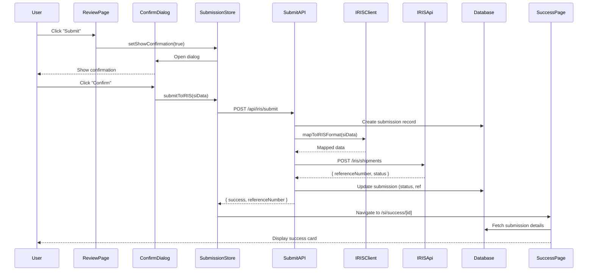

# Implementation Plan: Submit Validated SI Data to IRIS API

## 1. Feature Overview

This feature enables external customers to review validated Shipping Instruction data and submit it to the IRIS API after confirming accuracy. The system provides a comprehensive pre-submission review, clear confirmation flow, and detailed feedback on submission status.

**Primary User Role:** External Customer

## 2. Component Analysis & Reuse Strategy

**Existing Components:**
- `ExtractedDataForm` (`src/components/features/si-upload/ExtractedDataForm.tsx`) - **REUSE** in readonly mode for review
- `ValidationSummaryCard` (`src/components/features/validation/ValidationSummaryCard.tsx`) - **REUSE** for final validation check
- `Card` (`src/components/ui/Card.tsx`) - **REUSE** for layout
- `Button` (`src/components/ui/Button.tsx`) - **REUSE** for actions
- `Toast` (`src/components/ui/Toast.tsx`) - **REUSE** for notifications

**New Components Required:**
- `SubmissionReviewPanel` - Comprehensive pre-submission review interface
- `ConfirmationDialog` - Modal confirmation before submission
- `SubmissionProgressTracker` - Track multi-step submission process
- `SubmissionSuccessCard` - Display submission confirmation and reference number
- `DataSummaryTable` - Condensed tabular view of all SI data

**Justification:** Reuse validation and form display components while adding submission-specific UI for review, confirmation, and status tracking.

## 3. Affected Files

**Backend & API:**
- `[CREATE] src/app/api/iris/submit/route.ts` - Submit SI data to IRIS API
- `[CREATE] src/lib/iris/client.ts` - IRIS API client wrapper
- `[CREATE] src/lib/iris/mapper.ts` - Map SI data to IRIS format
- `[CREATE] src/lib/iris/validator.ts` - Pre-submission IRIS validation
- `[CREATE] prisma/schema.prisma` - Database schema for submission tracking
- `[CREATE] src/lib/db/submissions.ts` - Database operations for submissions

**Frontend Components:**
- `[CREATE] src/components/features/submission/SubmissionReviewPanel.tsx`
- `[CREATE] src/components/features/submission/ConfirmationDialog.tsx`
- `[CREATE] src/components/features/submission/SubmissionProgressTracker.tsx`
- `[CREATE] src/components/features/submission/SubmissionSuccessCard.tsx`
- `[CREATE] src/components/features/submission/DataSummaryTable.tsx`
- `[CREATE] src/components/ui/Modal.tsx` - Reusable modal component
- `[CREATE] src/components/ui/ProgressBar.tsx` - Reusable progress bar

**Pages:**
- `[CREATE] src/app/si/review/[id]/page.tsx` - Submission review page
- `[CREATE] src/app/si/success/[submissionId]/page.tsx` - Success confirmation page

**Types & Interfaces:**
- `[CREATE] src/types/iris.ts` - IRIS API types
- `[CREATE] src/types/submission.ts` - Submission tracking types
- `[MODIFY] src/types/si.ts` - Add submission metadata

**State Management:**
- `[CREATE] src/stores/submission.ts` - Zustand store for submission state

**Testing:**
- `[CREATE] src/components/features/submission/SubmissionReviewPanel.test.tsx`
- `[CREATE] src/components/features/submission/SubmissionReviewPanel.visual.spec.ts`
- `[CREATE] src/components/features/submission/ConfirmationDialog.test.tsx`
- `[CREATE] src/components/features/submission/ConfirmationDialog.visual.spec.ts`
- `[CREATE] src/components/features/submission/SubmissionProgressTracker.test.tsx`
- `[CREATE] src/components/features/submission/SubmissionProgressTracker.visual.spec.ts`
- `[CREATE] src/components/features/submission/SubmissionSuccessCard.test.tsx`
- `[CREATE] src/components/features/submission/SubmissionSuccessCard.visual.spec.ts`
- `[CREATE] src/lib/iris/client.test.ts`
- `[CREATE] src/lib/iris/mapper.test.ts`
- `[CREATE] src/app/api/iris/submit/route.test.ts`

**Configuration:**
- `[MODIFY] .env` - Add IRIS API credentials
- `[CREATE] src/lib/constants/iris-config.ts` - IRIS API configuration

**Documentation:**
- `[CREATE] docs/erd.md` - Database ERD for submission tracking

## 4. Component Breakdown

### New Components

#### `SubmissionReviewPanel` (Server Component)
- **Location:** `src/components/features/submission/SubmissionReviewPanel.tsx`
- **Type:** Server Component (fetches data)
- **Responsibility:** Display comprehensive review of SI data before submission
- **Props:**
  ```typescript
  interface SubmissionReviewPanelProps {
    siData: ShippingInstructionData;
    validationResult: ValidationResult;
    showEditButton?: boolean;
    onSubmitClick?: () => void;
  }
  ```
- **Child Components:** `DataSummaryTable`, `ValidationSummaryCard`, `Button`

#### `ConfirmationDialog` (Client Component)
- **Location:** `src/components/features/submission/ConfirmationDialog.tsx`
- **Type:** Client Component (modal interaction)
- **Responsibility:** Show confirmation dialog before final submission
- **Props:**
  ```typescript
  interface ConfirmationDialogProps {
    isOpen: boolean;
    siData: ShippingInstructionData;
    onConfirm: () => void;
    onCancel: () => void;
    isSubmitting: boolean;
  }
  ```
- **Child Components:** `Modal`, `DataSummaryTable`, `Button`

#### `SubmissionProgressTracker` (Client Component)
- **Location:** `src/components/features/submission/SubmissionProgressTracker.tsx`
- **Type:** Client Component (animated progress)
- **Responsibility:** Display multi-step submission progress
- **Props:**
  ```typescript
  interface SubmissionProgressTrackerProps {
    steps: SubmissionStep[];
    currentStep: number;
    status: 'pending' | 'in-progress' | 'completed' | 'error';
  }
  
  interface SubmissionStep {
    id: string;
    label: string;
    status: 'pending' | 'active' | 'completed' | 'error';
  }
  ```
- **Child Components:** `ProgressBar`, `Card`

#### `SubmissionSuccessCard` (Server Component)
- **Location:** `src/components/features/submission/SubmissionSuccessCard.tsx`
- **Type:** Server Component (fetches submission details)
- **Responsibility:** Display submission confirmation with reference number
- **Props:**
  ```typescript
  interface SubmissionSuccessCardProps {
    submissionId: string;
    referenceNumber: string;
    submittedAt: Date;
    siData: ShippingInstructionData;
  }
  ```
- **Child Components:** `Card`, `Button`

#### `DataSummaryTable` (Client Component)
- **Location:** `src/components/features/submission/DataSummaryTable.tsx`
- **Type:** Client Component (table rendering)
- **Responsibility:** Display condensed tabular view of all SI fields
- **Props:**
  ```typescript
  interface DataSummaryTableProps {
    data: ShippingInstructionData;
    highlightChanges?: boolean;
    modifiedFields?: string[];
  }
  ```

#### `Modal` (Client Component)
- **Location:** `src/components/ui/Modal.tsx`
- **Type:** Client Component (portal-based overlay)
- **Responsibility:** Reusable modal component with gaming theme
- **Props:**
  ```typescript
  interface ModalProps {
    isOpen: boolean;
    onClose: () => void;
    title: string;
    children: React.ReactNode;
    size?: 'sm' | 'md' | 'lg' | 'xl';
  }
  ```

#### `ProgressBar` (Client Component)
- **Location:** `src/components/ui/ProgressBar.tsx`
- **Type:** Client Component
- **Responsibility:** Reusable progress bar with gaming aesthetics
- **Props:**
  ```typescript
  interface ProgressBarProps {
    progress: number; // 0-100
    status?: 'default' | 'success' | 'error';
    showLabel?: boolean;
    animated?: boolean;
  }
  ```

## 5. Design Specifications

**Note:** No Figma link provided. Following gaming design system with submission-specific enhancements.

### Color Palette

| Design Color | Semantic Purpose | Element | Implementation Method |
|--------------|-----------------|---------|------------------------|
| #000000 | Primary background | Page background | Direct hex value (bg-[#000000]) |
| #18181B | Card background | Review panels, modals | Direct hex value (bg-[#18181B]) |
| #27272A | Table row alternate | Data summary rows | Direct hex value (#27272A) |
| #22D3EE | Primary accent | Submit button, progress | Direct hex value (#22D3EE) |
| #A855F7 | Secondary accent | Secondary actions | Direct hex value (#A855F7) |
| #10B981 | Success state | Submission success, completed steps | Direct hex value (#10B981) |
| #EF4444 | Error state | Submission errors | Direct hex value (#EF4444) |
| #F97316 | Warning state | Warnings | Direct hex value (#F97316) |
| #FFFFFF | Primary text | Labels, headings, data | Direct hex value (#FFFFFF) |
| #A1A1AA | Secondary text | Helper text, timestamps | Direct hex value (#A1A1AA) |
| #52525B | Border/divider | Table borders, dividers | Direct hex value (#52525B) |

### Spacing & Layout

- **Review panel padding:** 24px (p-6)
- **Modal padding:** 32px (p-8)
- **Table cell padding:** 12px 16px (px-4 py-3)
- **Progress tracker spacing:** 16px between steps (gap-4)
- **Success card padding:** 32px (p-8)
- **Button spacing:** 16px gap (gap-4)
- **Section spacing:** 32px (space-y-8)

### Typography

- **Page title:** 32px / 700 / 1.2 line-height
- **Section heading:** 20px / 600 / 1.3 line-height
- **Table headers:** 14px / 600 / 1.4 line-height
- **Table data:** 14px / 400 / 1.5 line-height
- **Button text:** 16px / 500 / 1
- **Success message:** 18px / 500 / 1.4 line-height
- **Reference number:** 24px / 700 / 1.2 line-height (monospace)

### Visual Hierarchy

```
Review Page Container (bg-[#000000])
└── Review Section (max-w-4xl mx-auto p-6)
    ├── Header
    │   ├── Title
    │   └── Validation Status
    ├── ValidationSummaryCard
    ├── DataSummaryTable (bg-[#18181B])
    │   ├── Table Header (bg-[#27272A]/50)
    │   └── Table Rows (alternating bg)
    ├── Actions
    │   ├── Edit Button (secondary)
    │   └── Submit Button (primary, cyan)
    └── ConfirmationDialog (when triggered)
        ├── Modal Header
        ├── Final Review Summary
        └── Confirm/Cancel Buttons

Success Page Container
└── SubmissionSuccessCard (centered)
    ├── Success Icon (large, green glow)
    ├── Success Message
    ├── Reference Number (monospace, large)
    ├── Submission Details
    └── Actions (Download, New Submission)
```

### Submission Progress Steps

```
1. Preparing Data → 2. Validating → 3. Submitting to IRIS → 4. Confirming
```

Each step shows:
- Step number in circle
- Step label
- Status indicator (pending, active, completed, error)
- Connection line between steps

### Responsive Behavior

- **Mobile (<640px):** Stack elements vertically, reduce padding, simplify table layout
- **Tablet (≥640px):** Maintain card layout, full table display
- **Desktop (≥768px):** Full layout with max-w-4xl
- **Large (≥1024px):** Enhanced spacing, max-w-5xl

### Visual Verification Checklist

- [ ] Submit button has cyan background (#22D3EE) with hover glow
- [ ] Data summary table has alternating row backgrounds
- [ ] Table borders are subtle (#52525B)
- [ ] Progress tracker shows cyan for active step
- [ ] Completed steps show green checkmarks (#10B981)
- [ ] Success card has large green icon with glow
- [ ] Reference number uses monospace font
- [ ] Modal has dark background with cyan accent
- [ ] All spacing matches specification
- [ ] Confirmation dialog is centered and responsive

## 6. Data Flow & State Management

### TypeScript Types

**Location:** `src/types/submission.ts`

```typescript
export type SubmissionStatus = 
  | 'draft' 
  | 'validating' 
  | 'ready' 
  | 'submitting' 
  | 'submitted' 
  | 'failed';

export interface Submission {
  id: string;
  siDataId: string;
  status: SubmissionStatus;
  irisReferenceNumber?: string;
  submittedAt?: Date;
  createdAt: Date;
  updatedAt: Date;
  metadata: {
    attemptCount: number;
    lastError?: string;
  };
}

export interface SubmissionResult {
  success: boolean;
  referenceNumber?: string;
  submittedAt?: Date;
  errors?: string[];
}
```

**Location:** `src/types/iris.ts`

```typescript
export interface IRISSubmissionRequest {
  // IRIS API format (to be defined based on actual API spec)
  shipment: {
    shipper: IRISParty;
    consignee: IRISParty;
    cargo: IRISCargo;
    routing: IRISRouting;
    // ... other IRIS fields
  };
}

export interface IRISSubmissionResponse {
  success: boolean;
  referenceNumber: string;
  submittedAt: string;
  status: string;
}

// Additional IRIS types as needed
```

**Location:** `src/types/si.ts` (modifications)

```typescript
export interface ShippingInstructionData {
  // ... existing fields
  submission?: {
    id: string;
    status: SubmissionStatus;
    referenceNumber?: string;
    submittedAt?: Date;
  };
}
```

### Database Schema

**Location:** `prisma/schema.prisma`

```prisma
model ShippingInstruction {
  id            String   @id @default(uuid())
  userId        String
  data          Json
  status        String   @default("draft")
  createdAt     DateTime @default(now())
  updatedAt     DateTime @updatedAt
  
  submissions   Submission[]
}

model Submission {
  id                  String   @id @default(uuid())
  siId                String
  shippingInstruction ShippingInstruction @relation(fields: [siId], references: [id])
  status              String   @default("validating")
  irisReferenceNumber String?  @unique
  attemptCount        Int      @default(1)
  lastError           String?
  submittedAt         DateTime?
  createdAt           DateTime @default(now())
  updatedAt           DateTime @updatedAt
}
```

### State Management (Zustand)

**Location:** `src/stores/submission.ts`

```typescript
interface SubmissionState {
  // Current submission
  currentSubmission: Submission | null;
  submissionStep: number;
  isSubmitting: boolean;
  
  // Confirmation dialog
  showConfirmation: boolean;
  
  // Actions
  initializeSubmission: (siId: string) => Promise<void>;
  submitToIRIS: (siData: ShippingInstructionData) => Promise<SubmissionResult>;
  setShowConfirmation: (show: boolean) => void;
  resetSubmission: () => void;
}
```

### Data Flow

```
User clicks "Submit" on Review Page
  ↓
Show ConfirmationDialog
  ↓
User confirms submission
  ↓
Store: submitToIRIS() called
  ↓
Step 1: Validate data locally
  ↓
Step 2: POST /api/iris/submit { siData }
  ↓
Server: Map SI data to IRIS format
  ↓
Server: Submit to IRIS API
  ↓
IRIS returns reference number
  ↓
Server: Save submission to database
  ↓
Return { success, referenceNumber }
  ↓
Store: Update submission status
  ↓
Redirect to Success Page
  ↓
Display SubmissionSuccessCard
```

## 7. API Endpoints & Contracts

### POST /api/iris/submit

**Route Path:** `src/app/api/iris/submit/route.ts`

**HTTP Method:** POST

**Request:**
```typescript
{
  siId: string,
  siData: ShippingInstructionData
}
```

**Response (Success):**
```typescript
{
  success: true,
  submission: {
    id: string,
    referenceNumber: string,
    submittedAt: string (ISO 8601),
    status: 'submitted'
  }
}
```

**Response (Error):**
```typescript
{
  success: false,
  error: string,
  code: 'VALIDATION_FAILED' | 'IRIS_API_ERROR' | 'NETWORK_ERROR',
  details?: string[]
}
```

**Status Codes:**
- 200: Submission successful
- 400: Validation failed
- 500: IRIS API error or server error
- 503: IRIS API unavailable

**Core Logic:**
1. Validate SI data against IRIS requirements
2. Map SI data to IRIS API format
3. Create submission record in database (status: 'submitting')
4. Call IRIS API with mapped data
5. Handle IRIS API response
6. Update submission record (status: 'submitted', add reference number)
7. Return submission result
8. If error occurs, update submission (status: 'failed', save error)

---

### GET /api/iris/submissions/[id]

**Route Path:** `src/app/api/iris/submissions/[id]/route.ts`

**HTTP Method:** GET

**Response (Success):**
```typescript
{
  success: true,
  submission: Submission
}
```

**Status Codes:**
- 200: Submission found
- 404: Submission not found
- 403: Unauthorized access

**Core Logic:**
- Fetch submission from database by ID
- Verify user owns the submission
- Return submission details

## 8. Integration Diagram



## 9. Styling

### Design to Implementation Mapping

| Design Element | Tailwind/CSS Implementation |
|----------------|---------------------------|
| Review page background | `className="min-h-screen bg-[#000000] p-6"` |
| Review panel card | `className="bg-[#18181B] rounded-lg border border-[#22D3EE]/30 p-6"` |
| Data summary table | `className="w-full border-collapse bg-[#18181B]"` |
| Table header | `className="bg-[#27272A]/50 text-[#FFFFFF] text-sm font-semibold px-4 py-3 text-left"` |
| Table row (odd) | `className="border-b border-[#52525B] hover:bg-[#27272A]/30"` |
| Table row (even) | `className="bg-[#27272A]/20 border-b border-[#52525B] hover:bg-[#27272A]/30"` |
| Table cell | `className="px-4 py-3 text-[#FFFFFF] text-sm"` |
| Submit button | `className="bg-[#22D3EE] text-[#000000] px-6 py-3 rounded-lg font-medium hover:shadow-lg hover:shadow-[#22D3EE]/50 transition-all"` |
| Edit button | `className="border border-[#A855F7] text-[#A855F7] px-6 py-3 rounded-lg font-medium hover:bg-[#A855F7]/10 transition-all"` |
| Modal backdrop | `className="fixed inset-0 bg-[#000000]/80 backdrop-blur-sm z-40"` |
| Modal content | `className="bg-[#18181B] rounded-lg border-2 border-[#22D3EE] p-8 max-w-2xl mx-auto z-50"` |
| Progress step (active) | `className="flex items-center justify-center w-10 h-10 rounded-full bg-[#22D3EE] text-[#000000] font-bold"` |
| Progress step (completed) | `className="flex items-center justify-center w-10 h-10 rounded-full bg-[#10B981] text-[#000000]"` |
| Progress step (pending) | `className="flex items-center justify-center w-10 h-10 rounded-full border-2 border-[#52525B] text-[#A1A1AA]"` |
| Success card | `className="bg-[#18181B] rounded-lg border-2 border-[#10B981] p-8 max-w-2xl mx-auto shadow-lg shadow-[#10B981]/30"` |
| Reference number | `className="text-[#22D3EE] text-2xl font-bold font-mono tracking-wider"` |

### Visual Implementation Checklist

- [ ] Review page has dark background (#000000)
- [ ] Data summary table has alternating row colors
- [ ] Table borders are subtle (#52525B)
- [ ] Submit button is cyan (#22D3EE) with dark text
- [ ] Submit button has glow on hover
- [ ] Edit button has purple border (#A855F7)
- [ ] Modal has backdrop blur effect
- [ ] Modal content has cyan border (#22D3EE)
- [ ] Progress tracker shows correct step status colors
- [ ] Completed steps have green background (#10B981)
- [ ] Active step has cyan background (#22D3EE)
- [ ] Success card has green border with glow
- [ ] Reference number uses monospace font
- [ ] All spacing matches specification

### Progress Tracker Visual

```
○ ─────── ○ ─────── ○ ─────── ○
1         2         3         4
Preparing Validating Submitting Confirming

States:
○ Pending (gray border)
● Active (cyan filled)
✓ Completed (green filled with checkmark)
✗ Error (red filled with X)
```

### Responsiveness

- **Mobile (<640px):**
  - Stack review sections vertically
  - Simplify table to card layout
  - Full-width buttons
  - Reduce modal padding
- **Tablet (≥640px):**
  - Full table display
  - Maintain card layout
- **Desktop (≥768px):**
  - Full layout with max-w-4xl
  - Side-by-side buttons
- **Large (≥1024px):**
  - Enhanced spacing
  - max-w-5xl

## 10. Testing Strategy

### Unit Tests

**File:** `src/lib/iris/mapper.test.ts`
- Test SI data to IRIS format mapping
- Test field transformations
- Test nested object mapping
- Test handling of optional fields

**File:** `src/lib/iris/client.test.ts`
- Test IRIS API client initialization
- Test request formatting
- Test error handling
- Test retry logic

**File:** `src/lib/db/submissions.test.ts`
- Test submission creation
- Test submission updates
- Test submission queries

### Component Tests

**File:** `src/components/features/submission/SubmissionReviewPanel.test.tsx`
- Test review display with various data
- Test edit button functionality
- Test submit button functionality

**File:** `src/components/features/submission/ConfirmationDialog.test.tsx`
- Test dialog open/close
- Test confirm action
- Test cancel action
- Test display of SI data summary

**File:** `src/components/features/submission/SubmissionProgressTracker.test.tsx`
- Test progress step rendering
- Test step status updates
- Test completion state

**File:** `src/components/features/submission/SubmissionSuccessCard.test.tsx`
- Test success message display
- Test reference number display
- Test action buttons

**File:** `src/components/features/submission/DataSummaryTable.test.tsx`
- Test table rendering with data
- Test field highlighting
- Test responsive behavior

### Visual Tests (Playwright)

**File:** `src/components/features/submission/SubmissionReviewPanel.visual.spec.ts`
- Test card background (#18181B) and border
- Test button colors (cyan for submit, purple for edit)
- Test button hover effects (glow)
- Test table layout and spacing
- Test across all viewports
- Use data-testid="submission-review-panel"

**File:** `src/components/features/submission/ConfirmationDialog.visual.spec.ts`
- Test modal backdrop (blur effect)
- Test modal border (#22D3EE)
- Test modal centering
- Test button layout
- Test across all viewports
- Use data-testid="confirmation-dialog"

**File:** `src/components/features/submission/SubmissionProgressTracker.visual.spec.ts`
- Test pending step color (gray #52525B)
- Test active step color (cyan #22D3EE)
- Test completed step color (green #10B981)
- Test step spacing and alignment
- Test connection lines
- Use data-testid="progress-tracker"

**File:** `src/components/features/submission/SubmissionSuccessCard.visual.spec.ts`
- Test green border (#10B981) with glow
- Test success icon size and color
- Test reference number styling (monospace, large)
- Test card centering
- Test across all viewports
- Use data-testid="submission-success-card"

**File:** `src/components/features/submission/DataSummaryTable.visual.spec.ts`
- Test alternating row colors
- Test table border color (#52525B)
- Test header background (#27272A)
- Test cell padding
- Test hover effects
- Use data-testid="data-summary-table"

### E2E Tests

**File:** `src/app/si/review/[id]/page.e2e.spec.ts`
- Test complete submission flow: review → confirm → submit → success
- Test validation before submission
- Test error handling during submission
- Test navigation after success

**File:** `src/app/si/success/[submissionId]/page.e2e.spec.ts`
- Test success page load
- Test reference number display
- Test action buttons (download, new submission)

### API Tests

**File:** `src/app/api/iris/submit/route.test.ts`
- Test successful submission
- Test validation failures
- Test IRIS API errors
- Test database updates
- Test retry logic

## 11. Accessibility (A11y) Considerations

- **Keyboard Navigation:**
  - Tab through all review sections
  - Enter to trigger submit button
  - Escape to close confirmation dialog
  - Focus management in modal (trap focus)
- **Screen Reader:**
  - Announce submission progress steps
  - Announce submission success
  - Label all table headers
  - Describe reference number purpose
- **ARIA Attributes:**
  - `role="dialog"` for confirmation modal
  - `aria-labelledby` for dialog title
  - `aria-describedby` for dialog description
  - `role="progressbar"` for submission progress
  - `aria-live="polite"` for status updates
- **Focus Management:**
  - Move focus to confirmation dialog when opened
  - Return focus to trigger button when closed
  - Move focus to first interactive element on success page
- **Color Contrast:** Ensure all text meets WCAG AA standards
- **Table Accessibility:** Proper `<th>` headers with scope attributes

## 12. Security Considerations

- **API Credentials:** Store IRIS API credentials in environment variables
- **Data Sanitization:** Sanitize all SI data before sending to IRIS
- **Rate Limiting:** Limit submission attempts per user
- **Idempotency:** Prevent duplicate submissions with idempotency keys
- **Authorization:** Verify user owns SI data before submission
- **Audit Trail:** Log all submission attempts with timestamps
- **Error Handling:** Don't expose IRIS API internals in error messages
- **Data Privacy:** Don't log sensitive SI data in error logs
- **HTTPS Only:** Ensure all IRIS API calls use HTTPS
- **Timeout Handling:** Implement proper timeouts for IRIS API calls
- **Input Validation:** Validate all data before sending to IRIS

## 13. Implementation Steps

### Phase 1: UI Implementation with Mock Data

**1. Setup & Dependencies:**

- [ ] Install Prisma: `npm install @prisma/client && npm install -D prisma` (Deferred to Phase 2)
- [ ] Initialize Prisma: `npx prisma init` (Deferred to Phase 2)
- [x] Create mock IRIS API responses
- [x] Create mock submission data
- [x] Install Zustand: `npm install zustand`

**2. Database Schema:**

- [ ] Define `ShippingInstruction` model in `prisma/schema.prisma` (Deferred to Phase 2)
- [ ] Define `Submission` model in `prisma/schema.prisma` (Deferred to Phase 2)
- [ ] Run migration: `npx prisma migrate dev` (Deferred to Phase 2)
- [ ] Generate Prisma client: `npx prisma generate` (Deferred to Phase 2)
- [ ] Create ERD diagram in `docs/erd.md` (Deferred to Phase 2)

**3. Types & Store:**

- [x] Define `Submission`, `SubmissionStatus`, `SubmissionResult` in `src/types/submission.ts`
- [x] Define IRIS API types in `src/types/iris.ts` (basic structure)
- [ ] Add submission metadata to `ShippingInstructionData` in `src/types/si-data.ts` (Not needed for Phase 1)
- [x] Create Zustand store in `src/stores/submission.ts`
  - [x] Define state structure
  - [x] Implement mock submitToIRIS action
  - [x] Implement confirmation dialog state
  - [x] Add progress tracking

**4. Base UI Components:**

- [x] Create `src/components/ui/Modal.tsx` with gaming theme
  - [x] Implement portal rendering
  - [x] Add backdrop with blur
  - [x] Add close on Escape
  - [x] Trap focus within modal
  - [x] Add data-testid="modal"
- [x] Create `src/components/ui/ProgressBar.tsx` with gaming theme
  - [x] Implement progress states
  - [x] Add cyan gradient fill
  - [x] Add animation (shimmer effect)
  - [x] Add data-testid="progress-bar"

**5. Submission Components (Mock Data):**

- [x] Create `src/components/features/submission/DataSummaryTable.tsx`
  - [x] Display all SI fields in table format
  - [x] Implement alternating row colors
  - [x] Add field highlighting for changes
  - [x] Add responsive card layout for mobile
  - [x] Add data-testid="data-summary-table"
  - [x] Add data-testid for each row
  
- [x] Create `src/components/features/submission/SubmissionProgressTracker.tsx`
  - [x] Display 4-step progress (Preparing, Validating, Submitting, Confirming)
  - [x] Implement step status visual states
  - [x] Add connection lines between steps
  - [x] Connect to store for current step
  - [x] Use mock progress initially
  - [x] Add data-testid="progress-tracker"
  - [x] Add data-testid for each step
  
- [x] Create `src/components/features/submission/ConfirmationDialog.tsx`
  - [x] Implement modal with dark background
  - [x] Display final data summary
  - [x] Add Confirm/Cancel buttons
  - [x] Connect to submission store
  - [x] Use mock submission action
  - [x] Add data-testid="confirmation-dialog"
  
- [x] Create `src/components/features/submission/SubmissionReviewPanel.tsx`
  - [x] Display ValidationSummaryCard
  - [x] Display DataSummaryTable
  - [x] Add Edit button (navigates to edit page)
  - [x] Add Submit button (triggers confirmation)
  - [x] Configure to use mock data
  - [x] Add data-testid="submission-review-panel"
  
- [x] Create `src/components/features/submission/SubmissionSuccessCard.tsx`
  - [x] Display large success icon with green glow
  - [x] Display success message
  - [x] Display reference number (large, monospace)
  - [x] Display submission timestamp
  - [x] Add action buttons (Download, New Submission)
  - [x] Configure to use mock data
  - [x] Add data-testid="submission-success-card"

**6. Pages:**

- [x] Create `app/si/review/[id]/page.tsx`
  - [x] Fetch SI data by ID (from mock)
  - [x] Render SubmissionReviewPanel
  - [x] Add page metadata
  - [x] Handle loading state (via not found)
  - [x] Handle not found state
  
- [x] Create `app/si/success/[submissionId]/page.tsx`
  - [x] Fetch submission by ID (from store)
  - [x] Render SubmissionSuccessCard
  - [x] Show SubmissionProgressTracker during submission
  - [x] Handle error states
  - [x] Add page metadata

**7. Styling Verification:**

- [x] Verify review page dark background (#000000)
- [x] Verify data summary table alternating rows
- [x] Verify table borders (#52525B)
- [x] Verify submit button cyan (#22D3EE) with glow on hover
- [x] Verify edit button purple border (#A855F7)
- [x] Verify modal backdrop blur effect
- [x] Verify modal cyan border (#22D3EE)
- [x] Verify progress tracker step colors (gray, cyan, green)
- [x] Verify success card green border (#10B981) with glow
- [x] Verify reference number monospace font
- [x] Verify all spacing matches spec
- [x] Add shimmer animation to globals.css

**8. UI Testing (Mock Data):**

- [x] Write component tests for `DataSummaryTable.test.tsx`
- [x] Write component tests for `SubmissionProgressTracker.test.tsx`
- [x] Write component tests for `ConfirmationDialog.test.tsx`
- [ ] Write component tests for `SubmissionReviewPanel.test.tsx` (Requires router mocking)
- [ ] Write component tests for `SubmissionSuccessCard.test.tsx` (Requires router mocking)
- [x] Write store tests for `submission.test.ts`

**9. Playwright Visual Tests:**

- [x] Create `src/components/features/submission/DataSummaryTable.visual.spec.ts`
  - [x] Test alternating row colors using RGB assertions
  - [x] Test table border color (#52525B)
  - [x] Test header background (#27272A)
  - [x] Test cell padding and spacing
  - [x] Test hover effects
  - [x] Test across all viewports
  
- [x] Create `src/components/features/submission/SubmissionProgressTracker.visual.spec.ts`
  - [x] Test pending step color (gray) using RGB
  - [x] Test active step color (cyan) using RGB
  - [x] Test completed step color (green) using RGB
  - [x] Test step spacing and alignment
  - [x] Test connection line styles
  - [x] Test across all viewports
  
- [ ] Create `src/components/features/submission/ConfirmationDialog.visual.spec.ts`
  - Test modal backdrop blur
  - Test modal border (#22D3EE)
  - Test modal centering
  - Test button colors and layout
  - Test across all viewports
  
- [ ] Create `src/components/features/submission/SubmissionReviewPanel.visual.spec.ts`
  - Test review panel layout
  - Test submit button cyan color with glow
  - Test edit button purple border
  - Test section spacing
  - Test across all viewports
  
- [ ] Create `src/components/features/submission/SubmissionSuccessCard.visual.spec.ts`
  - Test green border (#10B981) with glow using RGB
  - Test success icon color and size
  - Test reference number styling (24px, bold, monospace)
  - Test card centering
  - Test across all viewports

**10. Accessibility & Manual Testing:**

- [ ] Test keyboard navigation through review page
- [ ] Test Enter key to submit
- [ ] Test Escape to close modal
- [ ] Test focus trap in confirmation dialog
- [ ] Test screen reader announcements
- [ ] Test table navigation with keyboard
- [ ] Manual testing of submission flow
- [ ] Cross-browser testing

### Phase 2: API Integration with Real Data

**11. IRIS API Integration:**

- [ ] Obtain IRIS API credentials and documentation
- [ ] Add IRIS API configuration to `.env`
- [ ] Create `src/lib/constants/iris-config.ts` with API endpoints
- [ ] Create `src/lib/iris/client.ts`
  - Implement HTTP client wrapper
  - Add authentication headers
  - Implement retry logic
  - Add timeout handling
  - Add error mapping
- [ ] Create `src/lib/iris/mapper.ts`
  - Map ShippingInstructionData to IRIS format
  - Handle field transformations
  - Handle optional fields
  - Validate mapped data
- [ ] Create `src/lib/iris/validator.ts`
  - Implement IRIS-specific validation rules
  - Pre-validate before submission
  - Return validation errors

**12. Database Operations:**

- [ ] Create `src/lib/db/submissions.ts`
  - Implement createSubmission
  - Implement updateSubmission
  - Implement getSubmissionById
  - Implement getUserSubmissions

**13. API Endpoint:**

- [ ] Create `src/app/api/iris/submit/route.ts`
  - Validate request
  - Create submission record (status: 'validating')
  - Validate SI data against IRIS rules
  - Map SI data to IRIS format
  - Update submission (status: 'submitting')
  - Call IRIS API via client
  - Handle IRIS response
  - Update submission (status: 'submitted', add ref#)
  - Return submission result
  - Handle errors, update submission (status: 'failed')
  - Add rate limiting
  - Add idempotency support
  
- [ ] Create `src/app/api/iris/submissions/[id]/route.ts`
  - Implement GET endpoint
  - Fetch submission from database
  - Verify authorization
  - Return submission details

**14. Integration:**

- [ ] Update SubmissionStore to use real API
  - Replace mock submitToIRIS with real POST request
  - Update progress tracking based on actual steps
  - Handle real submission errors
  - Implement retry logic
  
- [ ] Update SubmissionReviewPanel
  - Fetch real SI data
  - Fetch real validation results
  - Handle loading states
  
- [ ] Update SubmissionSuccessCard
  - Fetch real submission details
  - Display actual reference number
  - Handle missing data gracefully

**15. Backend Testing:**

- [ ] Write unit tests for IRIS client
- [ ] Write unit tests for IRIS mapper
- [ ] Write unit tests for IRIS validator
- [ ] Write unit tests for database operations
- [ ] Write API tests for submit endpoint
- [ ] Write API tests for submissions endpoint
- [ ] Test with various SI data scenarios
- [ ] Test IRIS API error scenarios

**16. Integration Testing:**

- [ ] Update component tests to use real API (mocked fetch)
- [ ] Test submission flow end-to-end
- [ ] Test error scenarios (network failure, IRIS error)
- [ ] Test idempotency (duplicate submissions)
- [ ] Create E2E test for complete submission flow

**17. Performance & Security:**

- [ ] Implement rate limiting (e.g., 5 submissions per minute)
- [ ] Implement idempotency keys
- [ ] Add audit logging for all submissions
- [ ] Test timeout handling
- [ ] Optimize database queries
- [ ] Add retry logic with exponential backoff
- [ ] Security audit of IRIS integration

**18. Final Documentation & Polishing:**

- [ ] Document IRIS API integration
- [ ] Document submission flow in user guide
- [ ] Add JSDoc comments to all components
- [ ] Update ERD with final schema
- [ ] Document error codes and handling
- [ ] Final accessibility audit
- [ ] Final cross-browser testing
- [ ] Code review and refactoring

## References

- **IRIS API Documentation:** (To be provided by IRIS team)
- **Prisma Documentation:** https://www.prisma.io/docs
- **Zustand State Management:** https://zustand-demo.pmnd.rs/
- **Gaming Design System:** `.github/instructions/design-system.instructions.md`
- **Technical Standards:** `.github/instructions/technical.instructions.md`
- **User Story 1 Plan:** `docs/plans/01-upload-and-extract-si-data-from-pdf-plan.md`
- **User Story 2 Plan:** `docs/plans/02-validate-and-auto-fix-extracted-si-data-plan.md`
- **User Story 3 Plan:** `docs/plans/03-manually-edit-si-data-with-pdf-reference-plan.md`
