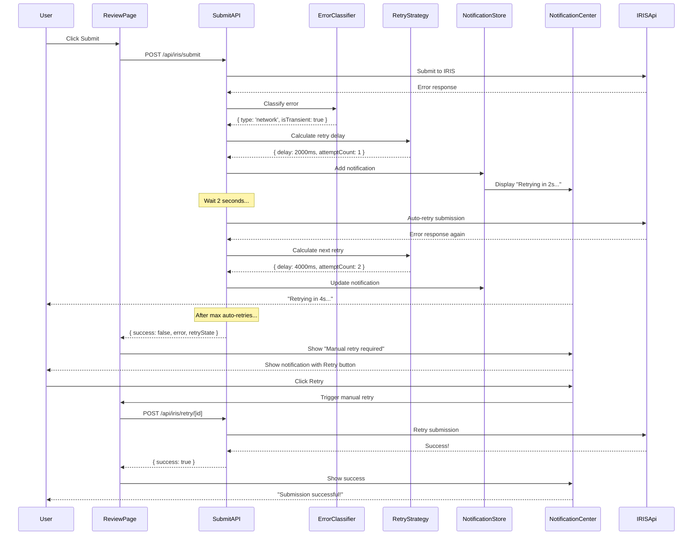

# Implementation Plan: Handle Submission Failures with Retry and Notifications

## 1. Feature Overview

This feature implements robust error handling for IRIS API submission failures, including automatic retry logic with exponential backoff, user notifications, manual retry options, and data preservation. The goal is to ensure external customers never lose their work and can successfully complete submissions even when transient failures occur.

**Primary User Role:** External Customer

## 2. Component Analysis & Reuse Strategy

**Existing Components:**
- `SubmissionProgressTracker` (`src/components/features/submission/SubmissionProgressTracker.tsx`) - **MODIFY** to show error states
- `Toast` (`src/components/ui/Toast.tsx`) - **REUSE** for notifications
- `Button` (`src/components/ui/Button.tsx`) - **REUSE** for retry actions
- `Card` (`src/components/ui/Card.tsx`) - **REUSE** for error displays
- `Modal` (`src/components/ui/Modal.tsx`) - **REUSE** for error details

**New Components Required:**
- `ErrorDetailsPanel` - Display detailed error information
- `RetryButton` - Smart retry button with cooldown
- `SubmissionHistory` - Show history of submission attempts
- `NotificationCenter` - Centralized notification system
- `ErrorRecoveryWizard` - Guide users through error resolution

**Justification:** Extend existing submission components with error handling capabilities while adding specialized error recovery UI.

## 3. Affected Files

**Backend & API:**
- `[MODIFY] src/app/api/iris/submit/route.ts` - Add retry logic and error handling
- `[CREATE] src/app/api/iris/retry/[submissionId]/route.ts` - Manual retry endpoint
- `[CREATE] src/lib/iris/retry-strategy.ts` - Retry logic with exponential backoff
- `[CREATE] src/lib/iris/error-classifier.ts` - Classify transient vs permanent errors
- `[CREATE] src/lib/notifications/manager.ts` - Notification management
- `[MODIFY] prisma/schema.prisma` - Add submission attempt tracking
- `[CREATE] src/lib/db/submission-attempts.ts` - Database operations for attempts

**Frontend Components:**
- `[CREATE] src/components/features/error-handling/ErrorDetailsPanel.tsx`
- `[CREATE] src/components/features/error-handling/RetryButton.tsx`
- `[CREATE] src/components/features/error-handling/SubmissionHistory.tsx`
- `[CREATE] src/components/features/error-handling/ErrorRecoveryWizard.tsx`
- `[CREATE] src/components/features/notifications/NotificationCenter.tsx`
- `[CREATE] src/components/features/notifications/NotificationItem.tsx`
- `[MODIFY] src/components/features/submission/SubmissionProgressTracker.tsx` - Add error states
- `[MODIFY] src/components/features/submission/ConfirmationDialog.tsx` - Add error recovery

**Pages:**
- `[CREATE] src/app/si/error/[submissionId]/page.tsx` - Error recovery page
- `[MODIFY] src/app/si/review/[id]/page.tsx` - Add error handling

**Types & Interfaces:**
- `[CREATE] src/types/errors.ts` - Error types and classifications
- `[CREATE] src/types/notifications.ts` - Notification types
- `[CREATE] src/types/retry.ts` - Retry strategy types
- `[MODIFY] src/types/submission.ts` - Add attempt tracking

**State Management:**
- `[MODIFY] src/stores/submission.ts` - Add retry and error handling
- `[CREATE] src/stores/notifications.ts` - Notification state management

**Testing:**
- `[CREATE] src/components/features/error-handling/ErrorDetailsPanel.test.tsx`
- `[CREATE] src/components/features/error-handling/ErrorDetailsPanel.visual.spec.ts`
- `[CREATE] src/components/features/error-handling/RetryButton.test.tsx`
- `[CREATE] src/components/features/error-handling/RetryButton.visual.spec.ts`
- `[CREATE] src/components/features/error-handling/ErrorRecoveryWizard.test.tsx`
- `[CREATE] src/components/features/error-handling/ErrorRecoveryWizard.visual.spec.ts`
- `[CREATE] src/components/features/notifications/NotificationCenter.test.tsx`
- `[CREATE] src/components/features/notifications/NotificationCenter.visual.spec.ts`
- `[CREATE] src/lib/iris/retry-strategy.test.ts`
- `[CREATE] src/lib/iris/error-classifier.test.ts`
- `[CREATE] src/app/api/iris/retry/[submissionId]/route.test.ts`

**Configuration:**
- `[CREATE] src/lib/constants/retry-config.ts` - Retry configuration
- `[CREATE] src/lib/constants/error-messages.ts` - User-friendly error messages

## 4. Component Breakdown

### New Components

#### `ErrorDetailsPanel` (Client Component)
- **Location:** `src/components/features/error-handling/ErrorDetailsPanel.tsx`
- **Type:** Client Component (expandable sections)
- **Responsibility:** Display detailed error information with troubleshooting guidance
- **Props:**
  ```typescript
  interface ErrorDetailsPanelProps {
    error: SubmissionError;
    attempts: SubmissionAttempt[];
    onRetry?: () => void;
    onEdit?: () => void;
    onContactSupport?: () => void;
  }
  ```
- **Child Components:** `Card`, `Button`, `SubmissionHistory`

#### `RetryButton` (Client Component)
- **Location:** `src/components/features/error-handling/RetryButton.tsx`
- **Type:** Client Component (stateful with cooldown)
- **Responsibility:** Smart retry button with cooldown timer and attempt tracking
- **Props:**
  ```typescript
  interface RetryButtonProps {
    onRetry: () => Promise<void>;
    attemptCount: number;
    maxAttempts?: number;
    cooldownSeconds?: number;
    disabled?: boolean;
  }
  ```

#### `SubmissionHistory` (Client Component)
- **Location:** `src/components/features/error-handling/SubmissionHistory.tsx`
- **Type:** Client Component (timeline rendering)
- **Responsibility:** Display timeline of submission attempts with outcomes
- **Props:**
  ```typescript
  interface SubmissionHistoryProps {
    attempts: SubmissionAttempt[];
    maxVisible?: number;
    expandable?: boolean;
  }
  ```

#### `ErrorRecoveryWizard` (Client Component)
- **Location:** `src/components/features/error-handling/ErrorRecoveryWizard.tsx`
- **Type:** Client Component (multi-step wizard)
- **Responsibility:** Guide users through error resolution steps
- **Props:**
  ```typescript
  interface ErrorRecoveryWizardProps {
    error: SubmissionError;
    siData: ShippingInstructionData;
    onComplete: (action: 'retry' | 'edit' | 'cancel') => void;
  }
  ```
- **Child Components:** `Modal`, `Button`, `Card`

#### `NotificationCenter` (Client Component)
- **Location:** `src/components/features/notifications/NotificationCenter.tsx`
- **Type:** Client Component (portal-based overlay)
- **Responsibility:** Centralized notification display system
- **Props:**
  ```typescript
  interface NotificationCenterProps {
    position?: 'top-right' | 'top-left' | 'bottom-right' | 'bottom-left';
    maxVisible?: number;
  }
  ```
- **Child Components:** `NotificationItem`

#### `NotificationItem` (Client Component)
- **Location:** `src/components/features/notifications/NotificationItem.tsx`
- **Type:** Client Component (animated entry/exit)
- **Responsibility:** Individual notification with action buttons
- **Props:**
  ```typescript
  interface NotificationItemProps {
    notification: Notification;
    onDismiss: (id: string) => void;
    onAction?: (id: string, action: string) => void;
  }
  ```

### Modified Components

#### `SubmissionProgressTracker` (MODIFY)
- **Changes Required:**
  - Add error step visualization
  - Show retry indicators
  - Display error messages inline
  - Add "View Details" link for errors

#### `ConfirmationDialog` (MODIFY)
- **Changes Required:**
  - Handle previous failure scenarios
  - Show warning if retrying after error
  - Display previous attempt count

## 5. Design Specifications

**Note:** No Figma link provided. Following gaming design system with error handling enhancements.

### Color Palette

| Design Color | Semantic Purpose | Element | Implementation Method |
|--------------|-----------------|---------|------------------------|
| #000000 | Primary background | Page background | Direct hex value (bg-[#000000]) |
| #18181B | Card background | Error panels, modals | Direct hex value (bg-[#18181B]) |
| #27272A | Hover/secondary | Timeline items | Direct hex value (#27272A) |
| #EF4444 | Error state | Error badges, borders, messages | Direct hex value (#EF4444) |
| #F97316 | Warning state | Warning messages, retry warnings | Direct hex value (#F97316) |
| #22D3EE | Primary accent | Retry button, links | Direct hex value (#22D3EE) |
| #10B981 | Success state | Successful retry | Direct hex value (#10B981) |
| #A855F7 | Info state | Information messages | Direct hex value (#A855F7) |
| #FFFFFF | Primary text | Labels, content | Direct hex value (#FFFFFF) |
| #A1A1AA | Secondary text | Timestamps, helper text | Direct hex value (#A1A1AA) |
| #52525B | Divider | Timeline connectors | Direct hex value (#52525B) |

### Spacing & Layout

- **Error panel padding:** 24px (p-6)
- **Notification padding:** 16px (p-4)
- **Timeline item spacing:** 16px (gap-4)
- **Retry button padding:** 12px 24px (px-6 py-3)
- **Error details padding:** 20px (p-5)
- **History timeline gap:** 12px (gap-3)

### Typography

- **Error title:** 24px / 600 / 1.3 line-height
- **Error message:** 16px / 400 / 1.5 line-height
- **Technical details:** 14px / 400 / 1.4 line-height (monospace)
- **Timeline labels:** 14px / 500 / 1.4 line-height
- **Notification text:** 14px / 400 / 1.5 line-height
- **Retry countdown:** 16px / 700 / 1 (monospace)

### Visual Hierarchy

```
Error Page Container (bg-[#000000])
└── Error Recovery Section (max-w-4xl mx-auto p-6)
    ├── Error Header (with icon and status)
    ├── ErrorDetailsPanel (bg-[#18181B] border-[#EF4444])
    │   ├── Error Summary
    │   ├── Technical Details (expandable)
    │   ├── Troubleshooting Steps
    │   └── Actions (Retry, Edit, Contact Support)
    ├── SubmissionHistory (timeline view)
    │   └── Attempt items with status icons
    └── ErrorRecoveryWizard (if applicable)

NotificationCenter (fixed top-right)
└── NotificationItem Stack
    └── Individual notifications with dismiss/action
```

### Error Type Visual Indicators

| Error Type | Icon | Border Color | Background |
|------------|------|-------------|------------|
| Transient (network) | ⟳ | #F97316 (orange) | #F97316/10 |
| Validation error | ✗ | #EF4444 (red) | #EF4444/10 |
| IRIS API error | ⚠ | #EF4444 (red) | #EF4444/10 |
| Timeout | ⏱ | #F97316 (orange) | #F97316/10 |
| Rate limit | 🛑 | #A855F7 (purple) | #A855F7/10 |

### Responsive Behavior

- **Mobile (<640px):** Stack error details vertically, full-width buttons, simplified timeline
- **Tablet (≥640px):** Maintain card layout, side-by-side action buttons
- **Desktop (≥768px):** Full layout with max-w-4xl, inline timeline
- **Large (≥1024px):** Enhanced spacing, max-w-5xl

### Visual Verification Checklist

- [ ] Error panel has red border (#EF4444)
- [ ] Error icon is red with glow effect
- [ ] Retry button is cyan (#22D3EE) with countdown
- [ ] Warning messages use orange (#F97316)
- [ ] Timeline items have connecting lines (#52525B)
- [ ] Notifications slide in from top-right
- [ ] Failed attempts show red status icon
- [ ] Retry attempts show loading state
- [ ] All spacing matches specification
- [ ] Countdown timer is monospace and visible

## 6. Data Flow & State Management

### TypeScript Types

**Location:** `src/types/errors.ts`

```typescript
export type ErrorType = 
  | 'network' 
  | 'validation' 
  | 'iris_api' 
  | 'timeout' 
  | 'rate_limit' 
  | 'unknown';

export type ErrorSeverity = 'warning' | 'error' | 'critical';

export interface SubmissionError {
  code: string;
  type: ErrorType;
  severity: ErrorSeverity;
  message: string;
  technicalDetails?: string;
  isTransient: boolean;
  retryable: boolean;
  userAction?: string; // Guidance for user
  timestamp: Date;
}
```

**Location:** `src/types/retry.ts`

```typescript
export interface RetryStrategy {
  maxAttempts: number;
  baseDelayMs: number;
  maxDelayMs: number;
  backoffMultiplier: number;
}

export interface RetryState {
  attemptCount: number;
  nextRetryAt?: Date;
  canRetry: boolean;
  cooldownSeconds?: number;
}
```

**Location:** `src/types/notifications.ts`

```typescript
export type NotificationType = 'success' | 'error' | 'warning' | 'info';

export interface Notification {
  id: string;
  type: NotificationType;
  title: string;
  message: string;
  actions?: NotificationAction[];
  duration?: number; // ms, undefined = manual dismiss
  timestamp: Date;
}

export interface NotificationAction {
  label: string;
  action: string;
  primary?: boolean;
}
```

**Location:** `src/types/submission.ts` (modifications)

```typescript
export interface SubmissionAttempt {
  id: string;
  submissionId: string;
  attemptNumber: number;
  status: 'pending' | 'in-progress' | 'success' | 'failed';
  error?: SubmissionError;
  createdAt: Date;
  completedAt?: Date;
}

export interface Submission {
  // ... existing fields
  attempts: SubmissionAttempt[];
  lastAttempt?: SubmissionAttempt;
  retryState?: RetryState;
}
```

### Database Schema Updates

**Location:** `prisma/schema.prisma`

```prisma
model Submission {
  // ... existing fields
  
  attempts SubmissionAttempt[]
}

model SubmissionAttempt {
  id            String   @id @default(uuid())
  submissionId  String
  submission    Submission @relation(fields: [submissionId], references: [id])
  attemptNumber Int
  status        String   @default("pending")
  errorCode     String?
  errorMessage  String?
  errorDetails  Json?
  createdAt     DateTime @default(now())
  completedAt   DateTime?
}
```

### State Management (Zustand)

**Location:** `src/stores/submission.ts` (modifications)

```typescript
interface SubmissionState {
  // ... existing fields
  retryState: RetryState | null;
  currentError: SubmissionError | null;
  
  // Actions
  retrySubmission: (submissionId: string) => Promise<void>;
  handleSubmissionError: (error: SubmissionError) => void;
  clearError: () => void;
}
```

**Location:** `src/stores/notifications.ts` (new)

```typescript
interface NotificationState {
  notifications: Notification[];
  
  // Actions
  addNotification: (notification: Omit<Notification, 'id' | 'timestamp'>) => void;
  dismissNotification: (id: string) => void;
  clearAll: () => void;
}
```

### Retry Flow

```
Submission fails
  ↓
Classify error (transient vs permanent)
  ↓
If transient:
  ↓
  Calculate retry delay (exponential backoff)
  ↓
  Show notification with retry countdown
  ↓
  Auto-retry after delay (up to max attempts)
  ↓
  If still failing → show manual retry option
  
If permanent:
  ↓
  Show error details
  ↓
  Offer "Edit Data" or "Contact Support"
  ↓
  Preserve data for editing
```

### Notification Flow

```
Error occurs
  ↓
Create notification with error details
  ↓
Add to notification store
  ↓
NotificationCenter displays notification
  ↓
User can:
  - Dismiss notification
  - Click action button (Retry, View Details)
  - Auto-dismiss after duration (if set)
```

## 7. API Endpoints & Contracts

### POST /api/iris/retry/[submissionId]

**Route Path:** `src/app/api/iris/retry/[submissionId]/route.ts`

**HTTP Method:** POST

**Request:**
```typescript
{
  submissionId: string,
  editedData?: ShippingInstructionData // if user edited before retry
}
```

**Response (Success):**
```typescript
{
  success: true,
  submission: Submission,
  attempt: SubmissionAttempt
}
```

**Response (Error):**
```typescript
{
  success: false,
  error: SubmissionError,
  retryState: RetryState
}
```

**Status Codes:**
- 200: Retry successful
- 400: Invalid request or max attempts reached
- 429: Rate limited, retry later
- 500: Server error

**Core Logic:**
1. Validate submissionId and user authorization
2. Check retry eligibility (max attempts, cooldown)
3. Create new SubmissionAttempt record
4. If editedData provided, validate and update
5. Apply retry strategy (get delay from attempt count)
6. Call IRIS API
7. Update SubmissionAttempt with result
8. If success, update Submission status
9. If failure, classify error and return retry state
10. Send notification to user

---

### GET /api/iris/submissions/[id]/attempts

**Route Path:** `src/app/api/iris/submissions/[id]/attempts/route.ts`

**HTTP Method:** GET

**Response (Success):**
```typescript
{
  success: true,
  attempts: SubmissionAttempt[]
}
```

**Status Codes:**
- 200: Attempts retrieved
- 404: Submission not found
- 403: Unauthorized

**Core Logic:**
- Fetch all attempts for submission
- Verify user authorization
- Return attempts ordered by attemptNumber

## 8. Integration Diagram



## 9. Styling

### Design to Implementation Mapping

| Design Element | Tailwind/CSS Implementation |
|----------------|---------------------------|
| Error page background | `className="min-h-screen bg-[#000000] p-6"` |
| Error panel card | `className="bg-[#18181B] rounded-lg border-2 border-[#EF4444] p-6 shadow-lg shadow-[#EF4444]/30"` |
| Error icon (large) | `className="w-16 h-16 text-[#EF4444] mb-4"` |
| Error title | `className="text-[#EF4444] text-2xl font-semibold mb-2"` |
| Error message | `className="text-[#FFFFFF] text-base mb-4"` |
| Technical details | `className="bg-[#000000] border border-[#52525B] rounded p-4 font-mono text-sm text-[#A1A1AA] overflow-x-auto"` |
| Retry button | `className="bg-[#22D3EE] text-[#000000] px-6 py-3 rounded-lg font-medium hover:shadow-lg hover:shadow-[#22D3EE]/50 disabled:opacity-50 disabled:cursor-not-allowed"` |
| Retry countdown | `className="text-[#22D3EE] font-mono font-bold text-base"` |
| Edit button | `className="border border-[#A855F7] text-[#A855F7] px-6 py-3 rounded-lg font-medium hover:bg-[#A855F7]/10"` |
| Timeline container | `className="space-y-3"` |
| Timeline item (failed) | `className="flex items-start gap-3 p-4 bg-[#18181B] border-l-4 border-[#EF4444] rounded"` |
| Timeline item (success) | `className="flex items-start gap-3 p-4 bg-[#18181B] border-l-4 border-[#10B981] rounded"` |
| Notification | `className="bg-[#18181B] border-l-4 border-[#EF4444] rounded-lg p-4 shadow-xl min-w-[320px] max-w-md"` |
| Notification success | `className="bg-[#18181B] border-l-4 border-[#10B981] rounded-lg p-4 shadow-xl min-w-[320px] max-w-md"` |
| Warning badge | `className="bg-[#F97316]/10 border border-[#F97316] text-[#F97316] px-3 py-1 rounded-full text-xs font-medium"` |

### Visual Implementation Checklist

- [ ] Error panel has red border (#EF4444) with glow
- [ ] Error icon is large (64px) and red
- [ ] Error title is red (#EF4444)
- [ ] Technical details have monospace font
- [ ] Technical details have dark background (#000000)
- [ ] Retry button is cyan (#22D3EE)
- [ ] Retry button shows countdown in monospace
- [ ] Timeline failed items have red left border
- [ ] Timeline success items have green left border
- [ ] Notifications slide in with animation
- [ ] Notification border matches type (red for error, green for success)
- [ ] Warning badges use orange (#F97316)
- [ ] All spacing matches specification

### Retry Button States

| State | Appearance | Behavior |
|-------|-----------|----------|
| Ready | Cyan background | Clickable |
| Countdown | Cyan with timer | Disabled, shows countdown |
| Disabled | Opacity 50% | Not clickable |
| Loading | Cyan with spinner | Shows loading animation |

### Notification Types

| Type | Border Color | Icon | Actions |
|------|-------------|------|---------|
| Error | #EF4444 | ✗ | Retry, Dismiss |
| Success | #10B981 | ✓ | Dismiss |
| Warning | #F97316 | ⚠ | View Details, Dismiss |
| Info | #22D3EE | ℹ | Dismiss |

### Responsiveness

- **Mobile (<640px):**
  - Stack error details vertically
  - Full-width buttons
  - Simplified timeline view
  - Notifications full-width at top
- **Tablet (≥640px):**
  - Maintain card layout
  - Side-by-side buttons
  - Full timeline display
- **Desktop (≥768px):**
  - Full layout with max-w-4xl
  - Notifications in top-right corner
- **Large (≥1024px):**
  - Enhanced spacing
  - max-w-5xl

## 10. Testing Strategy

### Unit Tests

**File:** `src/lib/iris/retry-strategy.test.ts`
- Test exponential backoff calculation
- Test max attempts enforcement
- Test max delay cap
- Test cooldown calculation

**File:** `src/lib/iris/error-classifier.test.ts`
- Test error type classification
- Test transient error detection
- Test retryable error detection
- Test user action generation

**File:** `src/lib/notifications/manager.test.ts`
- Test notification creation
- Test notification expiry
- Test action handling

**File:** `src/lib/db/submission-attempts.test.ts`
- Test attempt creation
- Test attempt queries
- Test attempt updates

### Component Tests

**File:** `src/components/features/error-handling/ErrorDetailsPanel.test.tsx`
- Test error display with various error types
- Test action button rendering
- Test expandable sections

**File:** `src/components/features/error-handling/RetryButton.test.tsx`
- Test countdown display
- Test click handling
- Test disabled state during countdown
- Test max attempts reached state

**File:** `src/components/features/error-handling/SubmissionHistory.test.tsx`
- Test timeline rendering
- Test attempt status display
- Test expandable history

**File:** `src/components/features/error-handling/ErrorRecoveryWizard.test.tsx`
- Test wizard steps
- Test navigation
- Test completion actions

**File:** `src/components/features/notifications/NotificationCenter.test.tsx`
- Test notification display
- Test notification stacking
- Test auto-dismiss
- Test action handling

**File:** `src/components/features/notifications/NotificationItem.test.tsx`
- Test notification rendering
- Test dismiss functionality
- Test action buttons

### Visual Tests (Playwright)

**File:** `src/components/features/error-handling/ErrorDetailsPanel.visual.spec.ts`
- Test error panel border (#EF4444) with glow
- Test error icon size (64px) and color
- Test technical details background (#000000)
- Test technical details monospace font
- Test button colors and spacing
- Test across all viewports
- Use data-testid="error-details-panel"

**File:** `src/components/features/error-handling/RetryButton.visual.spec.ts`
- Test retry button cyan color (#22D3EE)
- Test countdown display (monospace)
- Test disabled state (opacity 50%)
- Test hover glow effect
- Test loading spinner animation
- Use data-testid="retry-button"

**File:** `src/components/features/error-handling/SubmissionHistory.visual.spec.ts`
- Test timeline item left borders (red/green)
- Test timeline item spacing
- Test status icons
- Test timestamp formatting
- Use data-testid="submission-history"

**File:** `src/components/features/notifications/NotificationCenter.visual.spec.ts`
- Test notification positioning (top-right)
- Test notification border colors by type
- Test notification stacking
- Test slide-in animation
- Test across all viewports
- Use data-testid="notification-center"

**File:** `src/components/features/notifications/NotificationItem.visual.spec.ts`
- Test error notification border (#EF4444)
- Test success notification border (#10B981)
- Test warning notification border (#F97316)
- Test notification spacing and padding
- Test action button layout
- Use data-testid="notification-item-{type}"

### E2E Tests

**File:** `src/app/si/error/[submissionId]/page.e2e.spec.ts`
- Test error page load with failed submission
- Test retry button functionality
- Test countdown behavior
- Test successful retry flow
- Test edit data flow from error page

**File:** `src/app/si/review/[id]/page.e2e.spec.ts` (enhanced)
- Test submission with simulated transient failure
- Test automatic retry attempts
- Test notification display during retries
- Test manual retry after auto-retry exhaustion
- Test permanent error handling

### Integration Tests

**File:** `src/app/api/iris/retry/[submissionId]/route.test.ts`
- Test retry endpoint with valid submission
- Test retry with max attempts reached
- Test retry with edited data
- Test retry rate limiting
- Test retry state updates

## 11. Accessibility (A11y) Considerations

- **Keyboard Navigation:**
  - Tab to retry button
  - Enter to trigger retry
  - Escape to dismiss notifications
  - Tab through error recovery wizard steps
- **Screen Reader:**
  - Announce error occurred
  - Announce retry attempts
  - Announce countdown timer
  - Announce submission success after retry
  - Announce notification arrivals
- **ARIA Attributes:**
  - `role="alert"` for error messages
  - `aria-live="polite"` for notifications
  - `aria-live="assertive"` for critical errors
  - `aria-busy="true"` during retry
  - `aria-disabled="true"` for retry button during countdown
  - `aria-describedby` linking error details to retry button
- **Focus Management:**
  - Move focus to error panel when error occurs
  - Maintain focus on retry button during countdown
  - Move focus to success message after successful retry
- **Color Independence:**
  - Use icons in addition to colors for error types
  - Use text labels on all buttons
  - Provide text alternatives for all visual indicators
- **Time Limits:** Provide option to extend retry countdown if needed

## 12. Security Considerations

- **Rate Limiting:** Enforce strict rate limits on retry attempts (e.g., 5 per hour)
- **Attempt Tracking:** Log all retry attempts for audit trail
- **Data Persistence:** Encrypt stored SI data between retry attempts
- **Error Messages:** Sanitize error messages to prevent information leakage
- **Authorization:** Verify user owns submission before allowing retry
- **Timeout Protection:** Implement absolute timeout for total retry window
- **DDoS Prevention:** Use exponential backoff to prevent retry storms
- **Log Sanitization:** Don't log sensitive SI data in error logs
- **Session Validation:** Revalidate user session before each retry
- **Idempotency:** Use idempotency keys to prevent duplicate submissions on retry

## 13. Implementation Steps

### Phase 1: UI Implementation with Mock Data

**1. Setup & Dependencies:**

- [ ] Update database schema with SubmissionAttempt model
- [ ] Run Prisma migration
- [ ] Create mock error scenarios
- [ ] Create mock submission attempts data
- [ ] Define retry configuration constants

**2. Types & Error Classification:**

- [ ] Define `SubmissionError`, `ErrorType`, `ErrorSeverity` in `src/types/errors.ts`
- [ ] Define `RetryStrategy`, `RetryState` in `src/types/retry.ts`
- [ ] Define `Notification`, `NotificationAction` in `src/types/notifications.ts`
- [ ] Add `SubmissionAttempt` to `src/types/submission.ts`
- [ ] Create error messages constants in `src/lib/constants/error-messages.ts`
- [ ] Create retry config in `src/lib/constants/retry-config.ts`

**3. State Management:**

- [ ] Update `src/stores/submission.ts`
  - Add retryState to state
  - Add currentError to state
  - Implement mock retrySubmission action
  - Implement handleSubmissionError action
  - Add retry cooldown tracking
- [ ] Create `src/stores/notifications.ts`
  - Define notification state structure
  - Implement addNotification action
  - Implement dismissNotification action
  - Implement clearAll action
  - Add auto-dismiss timer logic

**4. Base Error Handling Components:**

- [ ] Create `src/components/features/error-handling/ErrorDetailsPanel.tsx`
  - Display error icon and title
  - Display error message
  - Display technical details (expandable)
  - Display troubleshooting steps
  - Add action buttons (Retry, Edit, Contact Support)
  - Configure to use mock error data
  - Add data-testid="error-details-panel"
  
- [ ] Create `src/components/features/error-handling/RetryButton.tsx`
  - Implement button with countdown timer
  - Show attempt count
  - Disable during countdown
  - Show loading state during retry
  - Handle max attempts reached
  - Use mock retry action
  - Add data-testid="retry-button"
  
- [ ] Create `src/components/features/error-handling/SubmissionHistory.tsx`
  - Display timeline of attempts
  - Show status icons (pending, success, failed)
  - Display timestamps
  - Show error messages for failed attempts
  - Implement expandable view
  - Configure to use mock attempts data
  - Add data-testid="submission-history"
  - Add data-testid for each attempt item

**5. Notification System:**

- [ ] Create `src/components/features/notifications/NotificationItem.tsx`
  - Display notification with type-specific styling
  - Show notification icon
  - Display title and message
  - Add action buttons
  - Implement dismiss functionality
  - Add slide-in/out animations
  - Add data-testid="notification-item"
  
- [ ] Create `src/components/features/notifications/NotificationCenter.tsx`
  - Implement portal rendering (top-right)
  - Stack notifications vertically
  - Manage notification lifecycle
  - Handle auto-dismiss timers
  - Connect to notification store
  - Limit max visible notifications (5)
  - Add data-testid="notification-center"

**6. Error Recovery Wizard:**

- [ ] Create `src/components/features/error-handling/ErrorRecoveryWizard.tsx`
  - Implement multi-step modal wizard
  - Step 1: Understand the error
  - Step 2: Choose action (Retry, Edit, Cancel)
  - Step 3: Confirm action
  - Connect to submission store
  - Use mock actions
  - Add data-testid="error-recovery-wizard"

**7. Modify Existing Components:**

- [ ] Modify `src/components/features/submission/SubmissionProgressTracker.tsx`
  - Add error step visualization
  - Show retry indicators on steps
  - Display inline error messages
  - Add "View Details" link
  - Update to handle error states from store
  
- [ ] Modify `src/components/features/submission/ConfirmationDialog.tsx`
  - Show warning if previous attempts failed
  - Display attempt count
  - Add "This is a retry" indicator
  - Connect to retry state from store

**8. Error Recovery Page:**

- [ ] Create `src/app/si/error/[submissionId]/page.tsx`
  - Fetch submission and attempts (from mock)
  - Display ErrorDetailsPanel
  - Display SubmissionHistory
  - Provide Retry, Edit, Cancel actions
  - Add page metadata
  - Handle loading and not found states

**9. Styling Verification:**

- [ ] Verify error panel red border (#EF4444) with glow
- [ ] Verify error icon is 64px and red
- [ ] Verify technical details have monospace font on dark background
- [ ] Verify retry button is cyan (#22D3EE)
- [ ] Verify countdown is monospace and visible
- [ ] Verify timeline failed items have red left border
- [ ] Verify timeline success items have green left border
- [ ] Verify notifications have correct border colors by type
- [ ] Verify notification slide-in animation
- [ ] Verify all spacing matches spec

**10. UI Testing (Mock Data):**

- [ ] Write component tests for `ErrorDetailsPanel.test.tsx`
- [ ] Write component tests for `RetryButton.test.tsx`
- [ ] Write component tests for `SubmissionHistory.test.tsx`
- [ ] Write component tests for `ErrorRecoveryWizard.test.tsx`
- [ ] Write component tests for `NotificationCenter.test.tsx`
- [ ] Write component tests for `NotificationItem.test.tsx`
- [ ] Write store tests for `submission.test.ts` (retry logic)
- [ ] Write store tests for `notifications.test.ts`

**11. Playwright Visual Tests:**

- [ ] Create `src/components/features/error-handling/ErrorDetailsPanel.visual.spec.ts`
  - Test error panel border (#EF4444) with glow using RGB
  - Test error icon size and color
  - Test technical details styling
  - Test button colors and layout
  - Test across all viewports
  
- [ ] Create `src/components/features/error-handling/RetryButton.visual.spec.ts`
  - Test button cyan color (#22D3EE) using RGB
  - Test countdown display (monospace)
  - Test disabled state opacity
  - Test hover glow effect
  - Test across all viewports
  
- [ ] Create `src/components/features/error-handling/SubmissionHistory.visual.spec.ts`
  - Test timeline border colors (red/green) using RGB
  - Test timeline spacing
  - Test status icons
  - Test across all viewports
  
- [ ] Create `src/components/features/notifications/NotificationCenter.visual.spec.ts`
  - Test notification positioning
  - Test notification border colors by type using RGB
  - Test stacking behavior
  - Test slide-in animation
  - Test across all viewports
  
- [ ] Create `src/components/features/notifications/NotificationItem.visual.spec.ts`
  - Test border colors for each type using RGB
  - Test spacing and padding
  - Test action button layout
  - Test across all viewports

**12. Accessibility & Manual Testing:**

- [ ] Test keyboard navigation through error page
- [ ] Test screen reader announcements for errors
- [ ] Test countdown timer accessibility
- [ ] Test notification screen reader announcements
- [ ] Test focus management in error recovery wizard
- [ ] Test color independence (icons + text)
- [ ] Manual testing of error scenarios
- [ ] Cross-browser testing

### Phase 2: API Integration with Real Data

**13. Backend Retry Logic:**

- [ ] Create `src/lib/iris/error-classifier.ts`
  - Implement error type detection
  - Classify transient vs permanent errors
  - Determine retryability
  - Generate user-friendly error messages
  - Generate troubleshooting guidance
  
- [ ] Create `src/lib/iris/retry-strategy.ts`
  - Implement exponential backoff calculation
  - Implement max attempts enforcement
  - Implement max delay cap
  - Calculate cooldown periods
  - Track retry history
  
- [ ] Create `src/lib/notifications/manager.ts`
  - Implement notification creation
  - Implement notification prioritization
  - Handle notification expiry
  - Manage notification queue

**14. Database Operations:**

- [ ] Create `src/lib/db/submission-attempts.ts`
  - Implement createAttempt
  - Implement getAttemptsBySubmissionId
  - Implement updateAttempt
  - Implement getLatestAttempt

**15. API Endpoints:**

- [ ] Modify `src/app/api/iris/submit/route.ts`
  - Add automatic retry logic
  - Integrate error classifier
  - Integrate retry strategy
  - Create SubmissionAttempt records
  - Send notifications on failures
  - Implement retry limits
  
- [ ] Create `src/app/api/iris/retry/[submissionId]/route.ts`
  - Validate retry eligibility
  - Check max attempts
  - Check cooldown period
  - Create new SubmissionAttempt
  - Call IRIS API
  - Update submission and attempt
  - Send notification
  - Return retry state
  - Add rate limiting
  
- [ ] Create `src/app/api/iris/submissions/[id]/attempts/route.ts`
  - Fetch all attempts for submission
  - Verify authorization
  - Return attempts with details

**16. Integration:**

- [ ] Update SubmissionStore to use real retry API
  - Replace mock retrySubmission with real POST request
  - Integrate real error handling
  - Implement cooldown tracking
  - Handle retry state updates
  
- [ ] Update NotificationStore
  - Connect to real notification events
  - Handle server-sent notifications
  - Implement persistent notifications
  
- [ ] Update ErrorDetailsPanel
  - Fetch real submission attempts
  - Display real error details
  - Handle real retry actions
  
- [ ] Update SubmissionHistory
  - Fetch real attempt history
  - Display real timestamps and errors
  
- [ ] Update error recovery page
  - Load real submission data
  - Handle real retry flow
  - Navigate based on real outcomes

**17. Backend Testing:**

- [ ] Write unit tests for error classifier
- [ ] Write unit tests for retry strategy
- [ ] Write unit tests for notification manager
- [ ] Write unit tests for database operations
- [ ] Write API tests for retry endpoint
- [ ] Write API tests for attempts endpoint
- [ ] Test retry with various error scenarios
- [ ] Test rate limiting enforcement

**18. Integration Testing:**

- [ ] Update component tests to use real API (mocked fetch)
- [ ] Test automatic retry flow
- [ ] Test manual retry flow
- [ ] Test notification flow
- [ ] Test error recovery wizard with real errors
- [ ] Create E2E test for complete error recovery flow
- [ ] Test with simulated IRIS API failures

**19. Performance & Monitoring:**

- [ ] Implement retry metrics collection
- [ ] Add logging for all retry attempts
- [ ] Monitor retry success rates
- [ ] Alert on high failure rates
- [ ] Optimize retry delay calculations
- [ ] Test performance with multiple concurrent retries

**20. Final Documentation & Polishing:**

- [ ] Document error handling strategy
- [ ] Document retry configuration
- [ ] Create troubleshooting guide
- [ ] Document notification system
- [ ] Add JSDoc comments
- [ ] Update ERD with attempt tracking
- [ ] Final accessibility audit
- [ ] Final cross-browser testing
- [ ] Code review and refactoring

## References

- **Exponential Backoff:** https://en.wikipedia.org/wiki/Exponential_backoff
- **Error Handling Best Practices:** https://www.nngroup.com/articles/error-message-guidelines/
- **Notification Design Patterns:** https://www.smashingmagazine.com/2017/04/designing-perfect-notification/
- **Gaming Design System:** `.github/instructions/design-system.instructions.md`
- **Technical Standards:** `.github/instructions/technical.instructions.md`
- **User Story 1 Plan:** `docs/plans/01-upload-and-extract-si-data-from-pdf-plan.md`
- **User Story 2 Plan:** `docs/plans/02-validate-and-auto-fix-extracted-si-data-plan.md`
- **User Story 3 Plan:** `docs/plans/03-manually-edit-si-data-with-pdf-reference-plan.md`
- **User Story 4 Plan:** `docs/plans/04-submit-validated-si-data-to-iris-api-plan.md`
